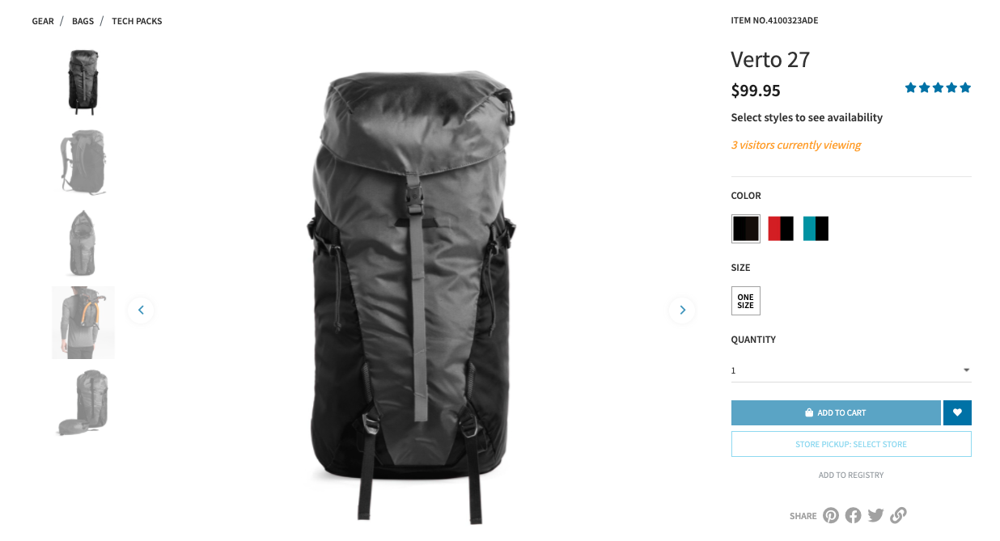

### Overview

Interaction Studio Trends (ISTrends) uses the power of social validation to increase conversions. Most consumers are overwhelmed by the product choices available to them and can find it challenging to confidently buy products online. Leverage the “wisdom of the crowd” to influence visitors on your site in real time and build confidence in products viewed by using view and purchase counters. These view and purchase counters drive both validation and urgency ultimately influencing conversions on your site.
Note: By enabling this feature, you are allowing Interaction Studio to return item purchase and view data via a public API.
---

### API Functionality

#### What does the API do?

Given an item ID(s) and a number of lookback minutes, the API is meant to return the number of views and recent purchases for the given item ID(s) within the lookback period.

#### How is the API called?
##### Parameters:

`itemIds: string`<br>
This should be either a singlular item ID or a comma-separated list of item IDs

`lookbackMins: integer`<br>
An integer representing the amount of minutes to be used for a lookback period. This value cannot exceed 2880 minutes (2 days).

##### Examples:
- Single ID: `https://<account_name>.evergage.com/api/dataset/<dataset_name>/social/smartTrends/Product?itemIds=4100323&lookbackMins=120`
- Multiple IDs: `https://<account_name>.evergage.com/api/dataset/<dataset_name>/social/smartTrends/Product?itemIds=1010263,1050855,1031064,1050946&lookbackMins=120`

#### What data can it return?
Returns an object with keys representing the itemID(s). The value for these keys each have an object containing stats for `visitViews` and `purchases` within the lookback period provided in the request.

##### Examples:
- Single ID: `{"4100323":{"visitViews":1,"purchases":0}}`

- Multiple IDs: `{"1050946":{"visitViews":0,"purchases":0},"1010263":{"visitViews":0,"purchases":0},"1050855":{"visitViews":0,"purchases":0},"1031064":{"visitViews":0,"purchases":0}}`

---

### Sample Template

<a href="./ISTrends.zip" download="ISTrends.zip">ISTrends.zip</a>

1. Confirm that you have configured your sitemap to map <a href="https://developer.evergage.com/web-integration/sitemap/contentzones">content zones</a> to display ISTrends.
2. Download <a href="./ISTrends.zip" download="ISTrends.zip">ISTrends.zip</a> which is the file containing the ISTrends web template.
3. Open the <a href="https://doc.evergage.com/display/EKB/Install+and+Use+the+Evergage+Launcher">Evergage Launcher</a>.
4. Select **Templates** > **View List** from the _Evergage Launcher_ tile.
5. On the _Templates_ tab, click **UPLOAD TEMPLATE**.
6. <a href="https://doc.evergage.com/display/EKB/Clone%2C+Download+or+Upload+a+Web+Template">Upload</a> the ISTrends.zip template to your template repository. You will need a <a href="https://doc.evergage.com/display/EKB/Add%2C+Edit%2C+and+Delete+Users+and+Roles">role</a> with permission to **Create/Edit** and **Publish/Delete** templates. Contact your company's Interaction Studio administrator for assistance.
7. In the **Content Zones in Template** field, enter the content zone names you defined during sitemapping.
8. In the _Template Editor_ section, select **Clientside Code**.
9. Configure the parameters that will be returned by the template:

     a. _Lookback Period_ - how far back do you want to look for views / purchases

     b. _Minimum views and purchases_ - only show the number of views or purchases above the defined threshold
10. If you want to use ISTrends with other catalog types (the default configuration is for products):

     a. _Line 9_ - change **{}).Product** to the item type. For example, if you are customizing the template for articles, change `{}).Product` to `{}).Article`.

     b. _Line 16_ - change the **URL** to reference the item type. For example, if you are customizing this template for articles, change `Product` to `Article`.
11. In the _Template Editor_ section, select **Serverside Code**.
12. Define what will be shown to campaign creators when working with this template. For example, you could change the template to show only the Visitors Text input field.
13. Click **SAVE** to save the template
14. Click **PUBLISH** to publish the template to make it available for web campaign development.

#### Sample Campaign on NTO

<spacer type="horizontal" size="40"></spacer>

<spacer type="horizontal" size="60  "></spacer>

<details>
<summary>Handlebars HTML</summary>
<p>

```html
{{!--
    Template: ISTrends

    Requirements:
    1) In order to leverage IS Trends, please contact support to enable the feature. IS Trends is available to both
    Growth & Premium edition accounts.
    2) Enable IS Trends for dataset (Settings > General Setup > Advanced Options > Enable IS Trends)
--}}

<ul id="mcis-trends" class="mcis-trends" data-evg-campaign-id="{{campaign}}"
data-evg-experience-id="{{experience}}" data-evg-user-group="{{userGroup}}">
</ul>

```
</p>
</details>

<br>

<details>
<summary>CSS</summary>
<p>

```css
#mcis-trends.mcis-trends {
    opacity: 0;
    padding: 0 15px;
    font-style: italic;
}

#mcis-trends.mcis-trends li {
    color: #ffa500;
    list-style-type: none;
}

```
</p>
</details>

<br>

<details>
<summary>Client-side JavaScript</summary>
<p>

```js
(function() {

    const ISTrends = (function() {

        const settings = {
            account: Evergage.getConfig().account,
            dataset: Evergage.getConfig().dataset,
            delay: 3000,
            id: (((Evergage.getCurrentPage() || {}).catalog || {}).Product || {})._id,
            lookbackMins: 2 * 60, // maximum 2 day
            minPurchases: 1,
            minViews: 1,
            reloadInterval: 30 * 1000,
            shouldCycle: true,
            stopLoadingAfter: 10 * 60 * 1000,
            url: () => `https://${settings.account}.evergage.com/api/dataset/${settings.dataset}/social/smartTrends/Product`
        };

        const global = {
            context: null,
            template: null
        };

        const actions = {
            handleResults: (results) => {
                const { id, minPurchases, minViews } = settings;
                const { purchasesText, visitorsText } = global.context;

                const mcisTrendsContainer = Evergage.cashDom('ul.mcis-trends');
                mcisTrendsContainer.css({ "opacity": "0" });
                mcisTrendsContainer.empty();
                if (results[id].purchases >= minPurchases) {
                    mcisTrendsContainer.append(`
                        <li id="evg-trend-minPurchases">
                            ${results[id].purchases} ${purchasesText}
                        </li>
                    `);
                }
                if (results[id].visitViews >= minViews) {
                    mcisTrendsContainer.append(`
                        <li id="evg-trend-minViews">
                            ${results[id].visitViews} ${visitorsText}
                        </li>
                    `);
                }
                mcisTrendsContainer.css({ "opacity": "1" });
            },
            loadTrends: () => {
                const { id, lookbackMins, url } = settings;
                const requestUrl = `${url()}?itemIds=${id}&lookbackMins=${lookbackMins}`;

                return fetch(requestUrl)
                    .then((resp) => {
                        return resp.json();
                    })
                    .then((data) => {
                        return actions.handleResults(data);
                    })
                    .catch((err) => {
                        console.warn(err);
                    });
            }
        };

        return {
            init: function({ context, template }) {
                const { reloadInterval, stopLoadingAfter } = settings;
                const { loadTrends } = actions;

                Object.assign(global, { context, template });
                loadTrends();
                const timerId = window.setInterval(loadTrends, reloadInterval);
                window.setTimeout(() => {
                    settings.shouldCycle = false;
                    clearInterval(timerId);
                }, stopLoadingAfter);
            }
        };

    })();

    /**
     * @function buildBindId
     * @param {Object} context
     * @description Create unique bind ID based on the campaign and experience IDs.
     */
    function buildBindId(context) {
        return `${context.campaign}:${context.experience}`;
    }

    function apply(context, template) {
        const contentZoneSelector = Evergage.getContentZoneSelector(context.contentZone);
        return Evergage.DisplayUtils
            .bind(buildBindId(context))
            .pageElementLoaded(contentZoneSelector)
            .then((element) => {
                if (Evergage.cashDom("#mcis-trends").length > 0) return;

                const html = template(context);
                Evergage.cashDom(element).html(html);
                ISTrends.init({ context, template });
            });
    }

    function reset(context, template) {
        Evergage.DisplayUtils.unbind(buildBindId(context));
        Evergage.cashDom("#mcis-trends").remove();
    }

    function control(context) {
        const contentZoneSelector = Evergage.getContentZoneSelector(context.contentZone);
        return Evergage.DisplayUtils
            .bind(buildBindId(context))
            .pageElementLoaded(contentZoneSelector)
            .then((element) => {
                Evergage.cashDom(element).attr({
                    "data-evg-campaign-id": context.campaign,
                    "data-evg-experience-id": context.experience,
                    "data-evg-user-group": "Control"
                });
            });
    }

    registerTemplate({
        apply: apply,
        reset: reset,
        control: control
    });

})();

```
</p>
</details>

<br>

<details>
<summary>Server-side TypeScript</summary>
<p>

```ts
export class ISTrendsTemplate implements CampaignTemplateComponent {

    purchasesText: string;

    visitorsText: string;

    run(context: CampaignComponentContext) {
        return {
            purchasesText: this.purchasesText || "recently purchased",
            visitorsText: this.visitorsText || "visitors currently viewing"
        };
    }

}

```
</p>
</details>

<br>
