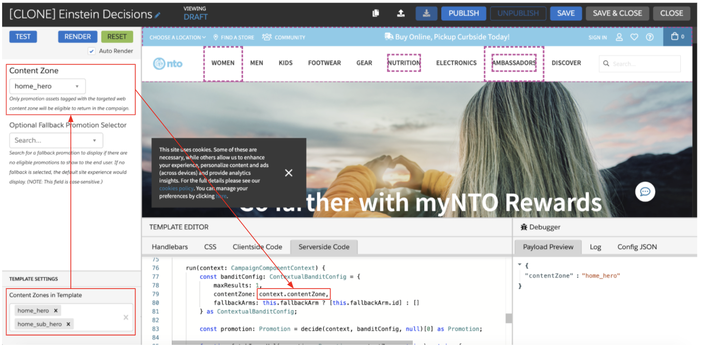

Compared to the Global Web Template, the Server-Side Einstein Decisions template has a slightly different server-side code configuration. This article outlines the crucial difference between the two templates spanning two key parts of the template: what content zone or tag the bandit leverages for decision-making and what data on the promotion is returned.

## Global Web Template
### Content Zone or Tag Selection: context.contentZone

The Global Web Template leverages `context.contentZone` to determine which promotion content zone Einstein Decisions should evaluate for a decision. The `context.contentZone` value maps to the targeted web content zone of the template, meaning the targeted web content zone serves the following two purposes. 

- Determining where the Einstein Decisions template is allowed to render on the site
- Filtering which promotions are eligible to be returned by the template (only promotions with an asset that has a content zone or tag that maps to the targeted web content zone will be eligible for decision-making)

To configure the targeted web content zone, you can use the **Content Zones in Template** selector in the Web Template Editor to select a single value or define a set of values for business users to pick from via a drop-down menu. 



By leveraging `context.contentZone` in the template, you effectively restrict which promotions can be returned. Since the content zone selector pane in the web template editor only displays web content zones defined in the sitemap, only promotions with an asset tied to a web content zone will be eligible to return.

### Campaign Response: Image URL and Promotion URL
The Global Web Template returns the primary data required for client-side rendering. In this case, the template is set to return just the image URL for the selected asset and the promotion URL. You can easily configure additional promotion attributes/information to return via the web template. 

## Server-Side Template
### Content Zone or Tag Selection: ContentZoneLookup

The server-side iteration of the template gives you a little more flexibility. Since the content zone selector pane leveraged in web templates is not available in the server-side template interface, you will use `ContentZoneLookup` instead of referencing `context.contentZone`. Unlike the web content zone selector, `ContentZoneLookup` is not restricted to only content zones defined in the sitemap. Instead, it enables a business user to select any content zone or tag value stored against a promotion asset or defined in the sitemap. The value that a business user selects will be the promotion content zone or tag that Einstein Decisions then leverages for real-time evaluation and decision-making.

### Campaign Response: Full Promotion
Since Interaction Studio is not responsible for rendering the decision passed back via a server-side campaign, the Server-Side template is designed to return all promotion information for the selected promotion by default. You can easily restrict what is returned in the response if the complete promotion data is not required.

Additionally, since the complete promotion data is being returned, as opposed to asset-specific data like an image URL, a business user will only need to define a fallback promotion as opposed to a fallback promotion along with a fallback asset.

<details>
<summary>Server-side TypeScript</summary>
<p>

```ts
import { ContextualBanditConfig, decide } from "corvus";
import { ItemReference, ContentZoneLookup } from "common";
function isCdnOrExternalImage(asset?: Asset) {
    return asset?.type === "CdnImage" || asset?.type === "ExternalImage";
}
export class PromotionSearchOptions implements Search<string> {
    search(context: GearLifecycleContext, searchString: string): ItemReference[] {
        if (!searchString) {
            return [];
        }
        const promos: Promotion[] = context.services.catalog.findByName("Promotion", searchString) as Promotion[];
        return promos.reduce((allPromos: ItemReference[], promo: Promotion) => {
            const promoItem = {
                itemType: "Promotion",
                id: promo.id,
                label: promo.attributes["name"] != null ? promo.attributes["name"].value : promo.id,
            } as ItemReference;
            allPromos.push(promoItem);
            return allPromos;
        }, []);
    }
}
export class AssetLookupOptions implements Lookup<string> {
    fallbackArm: ItemReference;
    constructor(fallbackArm: ItemReference) {
        this.fallbackArm = fallbackArm;
    }
    lookup(context: GearLifecycleContext): string[] {
        if (!this.fallbackArm) {
            return [];
        }
        const fullPromo: Promotion = context.services.catalog.findItem("Promotion", this.fallbackArm.id) as Promotion;
        if (!fullPromo || !fullPromo.assets) {
            return [];
        }
        return fullPromo.assets.reduce((contentZones: string[], asset: Asset) => {
            if (isCdnOrExternalImage(asset) && asset?.contentZones) {
                asset.contentZones.forEach(zone => { if (!(zone in contentZones)) contentZones.push(zone) });
            }
            return contentZones;
        }, []);
    }
}
export class EinsteinDecisionsTemplate implements CampaignTemplateComponent {
    @lookupOptions(() => new ContentZoneLookup())
    assetContentZoneOrTag: string;
    @searchOptions((self) => new PromotionSearchOptions())
    @title("Optional Fallback Promotion Selector")
    @subtitle(`Search for a fallback promotion to return if there are no eligible promotions to return for the end user.
    If no fallback is selected, no promotion will be returned. (NOTE: This field is case-sensitive.)`)
    fallbackArm: ItemReference;
    run(context: CampaignComponentContext) {
        const banditConfig: ContextualBanditConfig = {
            maxResults: 1,
            contentZone: this.assetContentZoneOrTag,
            fallbackArms: this.fallbackArm ? [this.fallbackArm.id] : []
        } as ContextualBanditConfig;
        const promotion: Promotion = decide(context, banditConfig, null)[0] as Promotion;
        return { promotion };
    }
}
 ```

</details>
</p>
