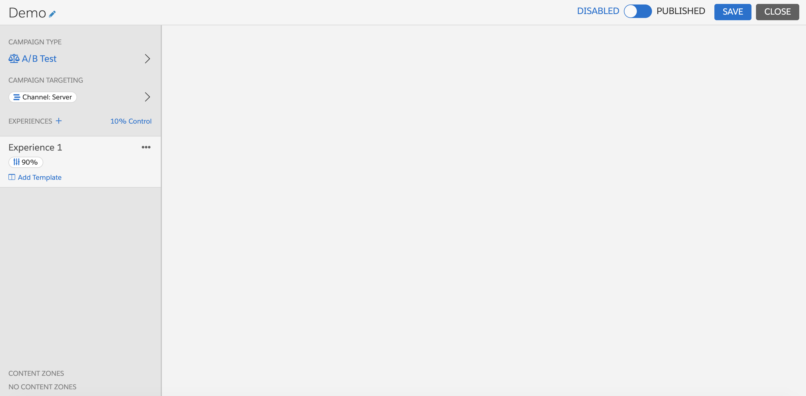
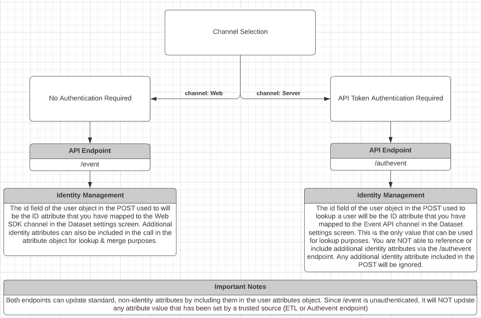
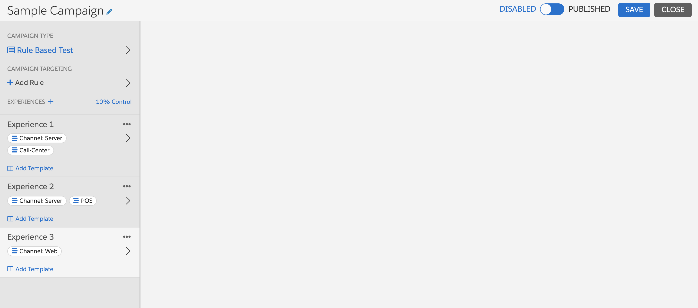
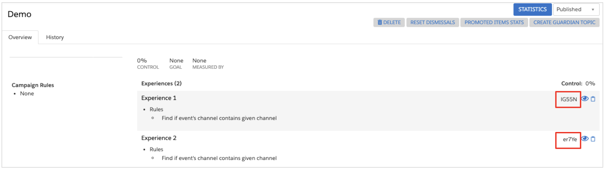

 Interaction Studio allows business users to build Server-Side campaigns and templates using a streamlined version of the web templates editor and the same campaign builder that you are familiar with from web campaigns. By leveraging the same campaign builder and the same underlying template infrastructure, clients can more easily extend campaigns across channels and even build a single campaign that can be called by multiple applications. Server-Side campaigns are available to premium edition clients.

## Login to Interaction Studio

1. Login to your Interaction Studio Account
2. Navigate to the dataset where you want to build your Server-Side campaign

## Create a New Server-Side Campaign

1. Select **Server-Side** from the left-hand navigation in the **Channels & Campaigns** section 
This will take you a screen where you can view all of your published & disabled Server-Side campaigns (published campaigns have bolded names, unpublished are not bolded)
2. To create a new campaign, click the New Campaign button in the upper right.

    a. When you create a new Server-Side campaign, it will open the campaign interface and have a campaign targeting rule of `channel: Server` applied by default. The campaign level channel: Server rule means that by default, a Server-Side campaign will require the /authevent API endpoint and an API token in order for a response to be returned. It will also reference the [ID attribute configured for the Event API](https://doc.evergage.com/display/EKB/Configure+the+Identity+System+for+the+Event+API) in the dataset settings screen.

    b. Campaign targeting rules are configurable by the business user. More information about channel targeting is provided in the Apply Targeting Logic section below.

**NOTE:** Creating a new Server-Side campaign using the Classic editor [documented here](https://doc.evergage.com/display/EKB/Server-Side+Campaigns) is no longer supported for clients leveraging the campaigns & templates system. If you have existing Server-Side classic campaigns, they will continue to function and you will still be able to access and edit those campaigns, but you will not be able to create a new one.


<br>
<div class='alert-blue'>
Both rule-based and A/B tests provide options for a control experience. With A/B tests, you determine control traffic using a slider; with rules-based campaigns you enter a control percentage in an input field.
</div>

## Determine the Campaign Type

There are two campaign types. A/B Test campaigns split traffic randomly into different groups based on percentages you define. Each group sees a different campaign experience. Rule Based Test campaigns follow the rules you define to determine which experience to show to each visitor. For example, using a rule-based test, you could target a segment of visitors who had not been to your site in 30 days and show them experience 1, then show experience 2 to visitors who had been to your site in the last 24 hours.

1. The default campaign type is *A/B Test*
2. Click **>** next to A/B Test 
3. Choose the campaign type that supports your goal for the campaign

    a. [A/B Test](https://doc.evergage.com/display/EKB/Create+a+Web+Campaign+from+a+Web+Campaign+Template)

    b. [Rule-based](https://doc.evergage.com/display/EKB/Use+Targeting+Rules+for+Web+Campaigns)
4. Toggle between **A/B Test** and **Rule Based Test** to change the type

## Create and Name Campaign Experiences

Determine how many experiences you want to have for your campaign. If you want to deliver a different campaign experience to various groups of qualified visitors, create additional experiences by cloning the configured experience. Then you can make modifications to the next experience using the same template, or apply a different template as needed.

1. Still in *Campaign Type*, click the following icon to clone an experience

2. Double click the Experience Name to change the name
3. Repeat the cloning and renaming process until you have the number of experiences you need for your campaign

<div class='alert-blue'>
The name of each experience shows up in your campaign statistics report. It can be helpful to name each experience with what is unique about that experience so you can interpret the results in reporting. For example, if you are building a cross-channel campaign, it is helpful to name each experience with their respective channel name (eg. Mobile, POS, Web, etc.)
<br><br>
For rules-based campaigns, if a user that qualifies for the campaign qualifies for multiple experiences, the experience higher in the list of experiences is considered the higher priority experience. You can drag and reorder campaign experiences on the campaign type screen.
</div>

## Determine Campaign Identity & Authentication Requirements

Server-Side campaigns have the same targeting options available as web campaigns. There is, however, important nuance around the channel rule that has identity and authentication implications. As described above, Server-Side campaigns have campaign level targeting logic of `channel: Server` applied by default. While a business user can choose to remove this logic, its inclusion means that the campaign will require an authenticated request via the /authevent endpoint with channel set to Server in the call in order to return a campaign response. Additional information around the implications for using or removing the `channel: Server` logic is as follows:


* **Authenticated Campaigns:**
    * **channel: Server Rule:**
        * **Authentication:** Any time `channel: Server` is present (at either the campaign level or experience level) it means that authentication will be required in order for Interaction Studio to return a campaign response, as Server is a default "Trusted" channel. (If your Interaction Studio account was provisioned prior to 1/28/2021, you might need to file a support ticket to get `channel: Server` added as a trusted channel)
        * **API Calling Pattern:** The inbound request that includes `channel: Server` MUST leverage the /authevent endpoint and include an API token. Information on the [/authevent](https://developer.evergage.com/event-api/event-api-specifications#authenticated-event-endpoint) endpoint and creating an API token in Interaction Studio are available at their respective links. If a POST request is made to the authevent endpoint without either channel: Server or an [API token](https://doc.evergage.com/display/EKB/API+Tokens) included, no campaign response data will be returned.
        * **Identity:** When channel → Server is applied to a POST request that goes through the /authevent endpoint, the id value provided will reference the Event API identity attribute that is configured via the identity settings screen (instructions / details on the API identity attribute configuration is [available here](https://doc.evergage.com/display/EKB/Configure+the+Identity+System+for+the+Event+API)). The configured value is the only value that can be used for user lookup via the authevent endpoint and if any other identity attributes are included in the call, they will be ignored.


<br>

* **Unauthenticated Campaigns:**
    * **channel: Web Rule**
        * **Authentication:** If the default `channel: Server` campaign level rule is removed, you can update a user and get campaign responses returned without authentication.
        * **API Calling Pattern:** The inbound request that includes `channel: Web` MUST leverage the /event endpoint. Information on the /event endpoint is available [here](/event-api). If a POST request is made to the `/event` endpoint with no channel value or a different channel value included, you will NOT be able to reference an identity attribute and might end up creating new users in the platform.
        * **Identity:** When `channel: Web` is applied to an inbound request that goes through the /event endpoint, the user.id value provided will reference the Web SDK identity attribute that is configured via the identity settings screen (instructions / details on the Web SDK identity attribute configuration is [available here](https://doc.evergage.com/display/EKB/Configure+the+Identity+System+for+the+Web+SDK)). More than one identity attribute can be included in the user.attributes object in order to facilitate additional profile merge scenarios. Note that this behavior is different than the /authevent endpoint above.
 

* **Hybrid Authenticated & Unauthenticated Campaigns:**
    * While A/B/n testing campaigns can ONLY be either fully authenticated or unauthenticated, rules based campaigns provide additional flexibility via experience level rules. By removing the default campaign level `channel: Server` rule, you can make certain experiences within a campaign either require or not require authentication. To do this, simply apply either `channel: Server` or `channel: Web` as a rule on the experience. 
    * **IMPORTANT NOTE:** If you decide to mix `channel: Web` & `channel: Server` logic into a single campaign, make sure the correct endpoints and Id values are being used in the call for the respective experiences.

<div class='alert-blue'>

**Channel Support**
If you include a channel value in the campaign targeting logic that is not either Web or Server, you will NOT be able to access identity attributes. Web & Server are the only channel values with identity support.
</div>

## Create Application Specific Experiences

There are a couple different ways for a user to build a single Server-Side campaign that can power experiences across multiple touch-points.

* **Restrict Campaign Response to Certain Applications at the Campaign Level:** If you want to limit a campaign response to only certain applications, you can layer in additional targeting rules via the Source → Application rule. By applying this rule, an inbound request needs to include one of the applications listed on the campaign rule (eg. Mobile, POS, Support, etc.) in order for a response to be returned. This type of targeting helps ensure you are only returning campaign responses relevant to that particular application.
* **Application Specific Experiences:** If you want to build different experiences for different applications, a business user would simply leverage a rules based campaign and then apply application targeting logic to the experience. To apply application targeting logic, simply apply an application rule at the experience level (eg. Mobile or POS). The application will be required in the inbound call in order to return the experience designed for that specific application. 



## Apply a Template

Once you have created a new campaign, added a name for the campaign, and applied your targeting logic, it's time to apply a template.

1. At the left, under your first experience, click **Add Template**
2. In the Select Template window, you will see all published Server-Side templates.
3. Once selected, the template name will appear under the experience and the business user can fill in the configuration options that the template developer has exposed

## Test Experiences

To test a Server-Side campaign that is built from template, you will need to use a tool to make POST requests. For campaigns that require authentication, you will need access to an API token. The campaign response generated by Interaction Studio is the same format as the response generated for web campaigns using the campaign and templates system. If you are unsure about your API Token review with your Interaction Studio account administrator and review the [documentation here.](https://doc.evergage.com/display/EKB/API+Tokens)

1. Create a new API **POST** request, The formatting of this POST URL is as follows:
    1. **Authenticated:** `/api2/authevent/{dataset}`
    1. **Unauthenticated:** `/api2/event/{dataset}`
    1. To test a campaign or experience where channel: Server is included requires an API token in order to return a response. By default, a Server-Side campaign has channel: Server configured in the campaign targeting logic meaning campaign responses will only return for authenticated requests. (If you removed the channel: Server logic, you need to reference the /event endpoint for unauthenticated posts/responses)
1. If using the `/authevent` endpoint you will need to leverage **Basic Auth** & enter your API token credentials your Key is the **Username** and the Secret as the **Password**
1. The **Body** content of the request must be constructed as **JSON** 
1. There are two types of test requests that you can submit (sample calls available to copy/paste below):

    a. `testMessages: true`    
    this configuration will allow you to test that the campaign targeting rules are being adhered to correctly. Only users that qualify for the campaign and all of the targeting logic will be eligible to receive a campaign response. If they do not qualify, the request will not return any campaign response information. The campaign MUST be in a published state in order to test that rules are being adhered to correctly. We recommend testing this in a separate dataset prior to moving the template to a campaign on the production dataset (remember templates can be easily transferred between datasets by downloading and uploading the template zip file).

    b. `testMessages: experienceId`
    In this configuration, you would replace the experienceId text with the id of the campaign experience your are looking to test (see image on the right to learn how to find your campaign experience id). Testing in this manner will IGNORE campaign rules, but allows you to validate the campaign response data looks correct. By including a specific experience ID, you ARE able to test an unpublished campaign experience. Testing a specific experience can ONLY be done via the /authevent endpoint. This means that if you have an unauthenticated campaign leveraging the `channel:Web` rule, in order to test the campaign response for a specific experience while the campaign is unpublished, you still need to use `channel:Server` in the POST.

**Sample authevent API POST Request**
```
{
    "action": "hello world",
    "debug": {
        "testMessages": "true"
    },
    "user": {
        "id": "sample Id"
    },
    "source": {
        "channel":"Server",
        "application":"POS"
    }
}
```

<div class='alert-blue'>
<br>

**Note:** the id value you select for a user will look for a user in the system based on the identity attribute that you have assigned to the Event API. Instructions/information on selecting the identity attribute for the Event API [is available here](https://doc.evergage.com/display/EKB/Configure+the+Identity+System+for+the+Event+API)
</div>

**testMessages: experienceId**

To find your campaigns experience Id, simply open the Server-Side campaign list screen, select the campaign you are intending to test and scroll down to the **Overview** section. You will see the experience Id next to the eye icon on the right side of the page (reference screenshot with highlighted value below). In order to test a specific experience, a trusted channel MUST be included in the call. This ensures that ignoring campaign rules does not ignore authentication requirements.

**Sample authevent API POST Request**
```
{
    "action": "hello world",
    "debug": {
        "testMessages": "experienceId"
    },
    "user": {
        "id": "sample UserId"
    },
    "source": {
        "channel":"Server"
    }
}
```

## Publish the Campaign

Once you have thoroughly tested your campaign, you need to publish it to make it live. The process for publishing a campaign can be done on the campaign list page or while editing the campaign.

1. While editing your campaign in the campaign editor, save any changes
1. The SAVE button will dim to let you know all changes have been saved
1. Slide the toggle to **PUBLISHED**
1. You will receive a confirmation message that the campaign was published
1. To disable a campaign, slide the toggle to **DISABLED**
1. Again, you will receive a confirmation message that the campaign was unpublished



<div class='alert-blue'>

**Campaign Access Controls**
If you want to know who has access to publish a campaign (or edit or create a new campaign) refer to [the roles based access guide](https://doc.evergage.com/display/EKB/Add%2C+Edit%2C+and+Delete+Users+and+Roles). Roles-based access is a great way to ensure that campaigns go through the proper approval process prior to publishing for live traffic. Server-Side campaign & template creation follows the same permissions associated with web campaigns & templates.
</div>

## Track Campaign Results

To track campaign stats on a Server-Side campaign, you will need to work with your web developer to pass stats information like impressions, clicks, items returned, etc. back via API. Information on how to pass campaign stats back to Interaction Studio is [available here](https://developer.evergage.com/campaign-development/web-templates/web-campaign-stats) on our developer documentation site. The stats will appear in the campaigns statistics report that is automatically generated for the campaign.
