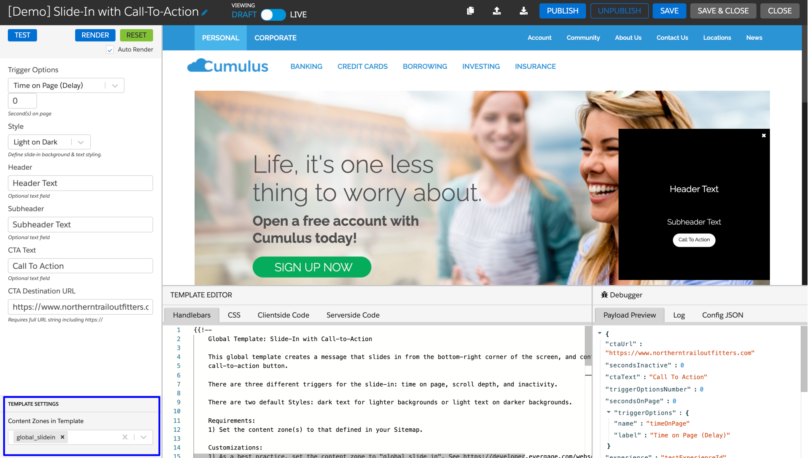
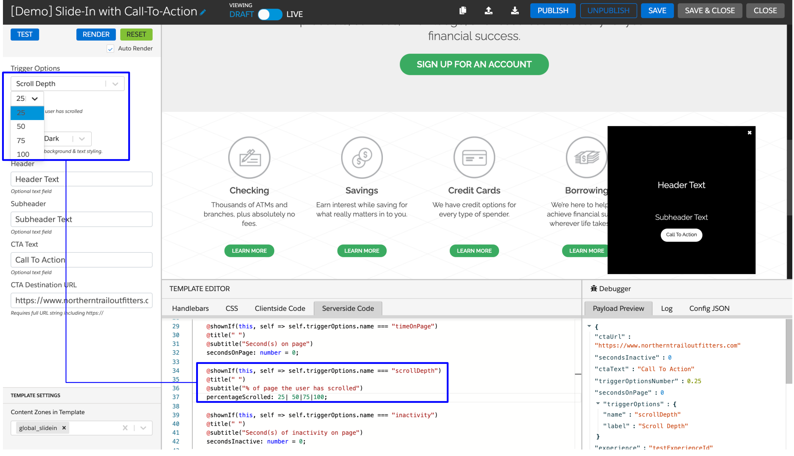
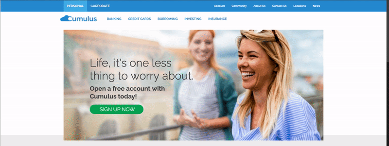
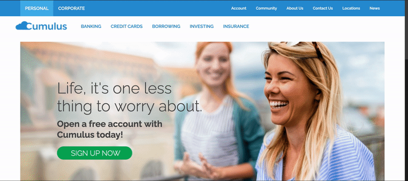

Developers can leverage existing global templates via the Global Templates tab in the Visual Editor to create reusable templates that enable marketers to deliver messages based on behavioral triggers. This guide takes you through modifying the Interaction Studio "Global Template: Slide-in With Call-To-Action", and its associated use cases.

## Slide-in With Call-To-Action Global Template

Using the "Slide-in With Call-To-Action" global template, you can deliver attention-grabbing slide-in messages that include a CTA to customers and prospects. You can choose from various trigger options, such as time on page, scroll depth, and inactivity, that determine when the message should appear.

### Template Configuration

The following steps describe how to configure the Slide-in With CTA global template.
1. In your sitemap, include content zones to target the "Slide-in With Call-To-Action" template. Consider the following when determining your content zone.
    - This template will not replace the selected content zone/selector.
    - This content zone must be present on all pages where the template should render.
    - Interaction Studio JS can render one campaign per content zone and renders the campaign with the highest priority.

    **Note:** As a best practice, create a unique global content zone, such as `global_slide_in`, as shown in the following sample code.

    ```js
    const config = {
        global: {
          contentZones: [
            {name: "global_slide_in", selector: "body > div.category-menu"},
          ]
        }
    }
    ```
1. Clone the Slide-in With CTA template global template and name it. By default, the cloned template will be named `[CLONED] Global template name`.
1. Under **Template Settings**, apply the content zone(s) added during site mapping to the template using the **Content Zones in Template** selector.
   
   
1. <span class="optional-text">Optional:</span> In the **Serverside Code** tab, configure what is shown or made available in the template to the business user. For example, you can add additional scroll depth percentage options that the business user can select from when they're configuring the campaign. The following image illustrates how you can set scroll depth percentages in the **Serverside Code**.
   
   
1. <span class="optional-text">Optional:</span> Configure the look and feel of the slide-in based on business requirements using template handlebars and CSS. The following unique styling options are available for the Slide-In With Call-To-Action template.
    - `animation-duration`: Determines the time in seconds for the slide-in animation to complete
    - `keyframes`: Determines the starting and ending position of the slide-in animation (the direction from which the slide-in slides in).

    The following code depicts example CSS that styles the slide-in element and handlebars that animates it to slide in from the left side of the page.

      ```css
      #evg-slide-in-with-cta {
        position: fixed;
        z-index: 1000000;
        top: auto !important;
        left: 5%;
        bottom: 10vh !important;
        right: auto;
        width: 300px;
        height: 300px;
        border: 1px solid #000;
        color: #fff;
        background-color: #000;
        font-family: inherit;
        animation-name: slideInDesktopMessage;
        animation-duration: 1s;
      }
    
      @keyframes slideInDesktopMessage {
        from {
          left: -90%;
        }
        to {
          left: 5%;
        }
      }
      ```
    
   The code above slides in the slide-in element from the left side (-90% to 5%) of the page.
    
   
    
    The following code depicts example CSS that styles the slide-in element and handlebars that animates it to slide in from the right side of the page.
      
      ```css
      #evg-slide-in-with-cta {
        position: fixed;
        z-index: 1000000;
        top: auto !important;
        right: 5%;
        bottom: 10vh !important;
        left: auto;
        width: 300px;
        height: 300px;
        border: 1px solid #000;
        color: #fff;
        background-color: #000;
        font-family: inherit;
        animation-name: slideInDesktopMessage;
        animation-duration: 1s;
      }
    
      @@keyframes slideInDesktopMessage {
        from {
          right: -90%;
        }
        to {
          right: 5%;
        }
      }
      ```
    
   The code above slides in the slide-in element from the right side (-90% to 5%) of the page.
   
   
    
   **Note:** To prevent unwanted jumps in the slide-in animation, ensure that the position of the slide-in aligns with the end of the slide-in's animation.
1. To save and publish the template, click **Save** and then click **Publish**.

   **Note:** A business user can only reference published templates in a campaign.
   
   