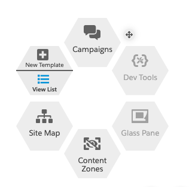
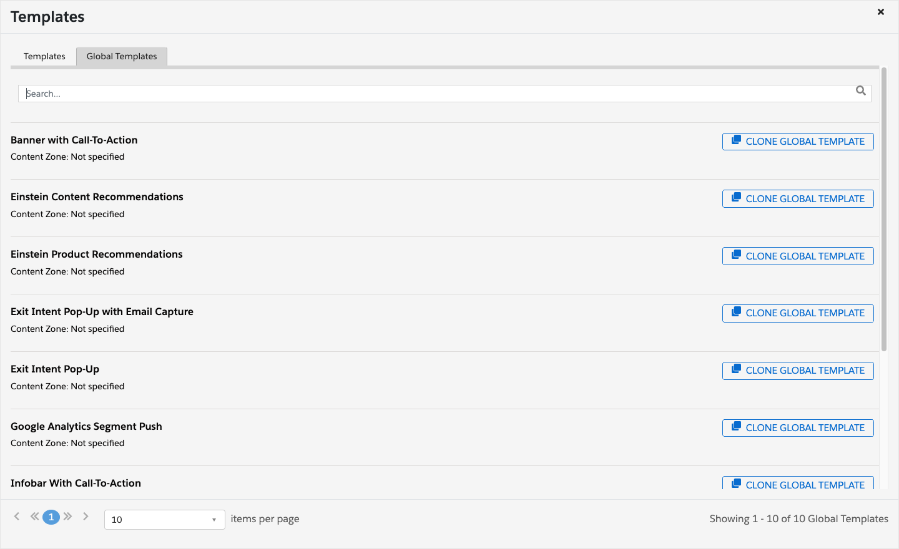
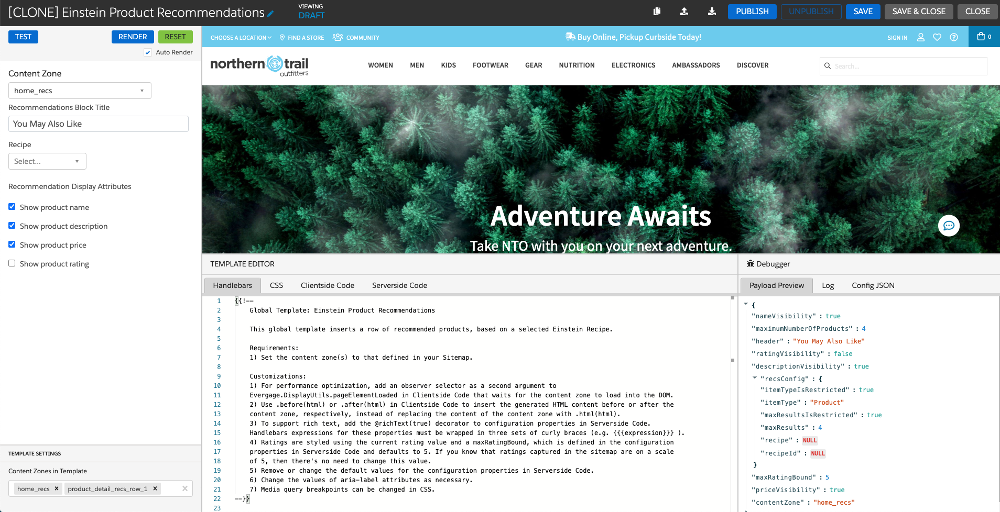
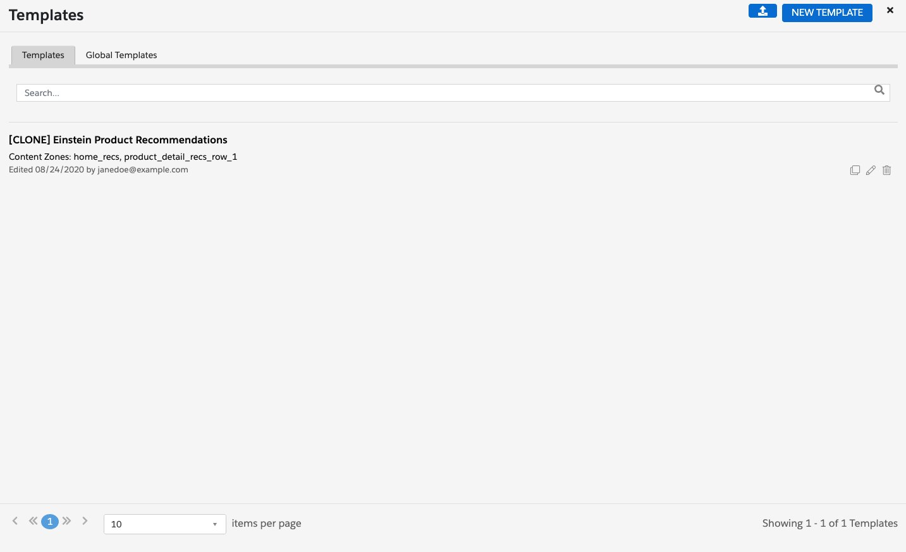

The simplest way to develop an Interaction Studio web template is to use one of our global templates and customize it for your business use case. To use a global template, follow the steps below:

1. Clone the global template that most closely represents your web channel use case.
2. Customize the template to meet the business user requirements.

The following sections present the steps for cloning a global template in Interaction Studio and the best practices for customizing global template code.

For information on the most current list of available global templates and their recommended web channel use cases, see [Work with Global Templates](https://doc.evergage.com/display/EKB/Work+with+Global+Templates) in the Interaction Studio business user knowledge base.

---

## Cloning a Global Template

To clone a global template, do the following:
1. Open the [Interaction Studio Launcher](https://doc.evergage.com/display/EKB/Install+and+Use+the+Evergage+Launcher) Chrome extension tool, and click the **View List** section of the template button:

2. Click the **Global Templates** tab to find a list of all currently available global templates.

3. To clone a global template for customization, click the **Clone Global Template** button associated with the global template you want to customize. 

    

4. Cloning a global template will open a new copy of the template, with the text "[CLONE]" prepended to the template name. 

---
**Note:** Cloning and customizing a global template does not alter the original version of the global template in the **Global Templates** tab. You can make as many clones of a global template as you require for different use cases.

---

    

---
**Note:** In global templates, comments are provided at the top of the code tabs to help template developers effectively customize the template. For an example of this, see the comments in the **Handlebars** tab in the above **[CLONE] Einstein Product Recommendations** figure.

---

5. Click **Save** to save the cloned version of the global template to your dataset. This cloned version will appear in the **Templates** tab along with any other templates you have created or cloned. 

    

## Customizing the Template
Once you have cloned a global template as described in the preceding section, customize the template components to meet the requirements of the business use case. As a best practice, we recommend you modify the template component code in the following order: 

1. Modify the server-side code in the **Serverside Code** tab. See [Web Template Server TypeScript](/campaign-development/web-templates/web-template-server-typescript) for more detail.
2. Modify the client-side code in the **Clientside Code** tab. See [Web Template Client JavaScript](/campaign-development/web-templates/web-template-client-javascript) for more detail.
3. Develop the Handlebars templated HTML code in the **Handlebars** tab. See [Web Template Handlebars](/campaign-development/web-templates/web-template-handlebars) for more detail.
4. Develop the CSS style code in the **CSS** tab. See [Web Template CSS](/campaign-development/web-templates/web-template-html-classes-and-css) for more detail.

## Template Developer Best Practices

Developers customizing global templates should follow the best practices outlined in the following articles:

* [Web Templates Style Guide and Coding Conventions](/campaign-development/web-templates/web-templates-style-guide-and-coding-conventions) provides a guide to writing consistent template code.
* [Web Template Building Best Practices](/campaign-development/web-templates/web-template-building-checklist) provides an outline of best practices for building templates that will run optimally on your website.
