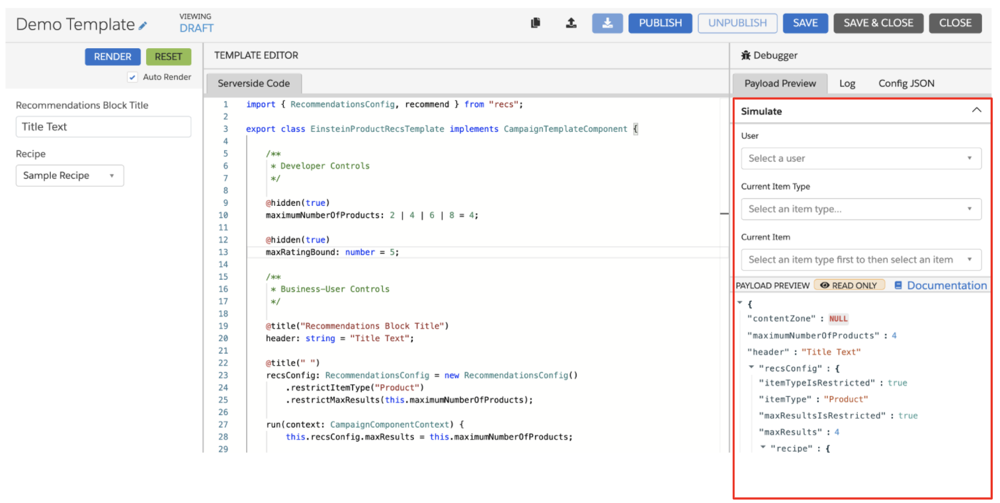

# Template Response Simulator

When developing a template in the Interaction Studio UI, you can simulate a template response without leaving the development interface. You can simulate the template response for an event by providing details about the event, such as the user a campaign renders for and the current item in the event. This article outlines the components of the simulator and describes how you can leverage it to aid template development and testing.

## Simulator Components
The payload simulator is located in the **Payload Preview** tab of the Template Editor and allows you to define the following components to simulate a campaign response.

* **User**: In the **User** field, you can search for any user profile in Interaction Studio by their `userId` or username. The template response payload references the user you select in this field.
* **Current Item Type & Current Item**: These fields are only necessary if the campaign requires contextual data such as the item currently viewed (This is a common requirement for recipes like co-browse, co-buy, similar items, etc.) You can configure a **Current Item** only after selecting the **Current Item Type**.

## Simulating a Template Response
To simulate a template, do the following. 
	
1. Enter the necessary simulator information in the **User**, **Current Item Type**, and **Current Item** fields. 
2. Enter the template configuration (the information a business user would provide while constructing a campaign).
	
You can now view the template payload response in the **Payload Preview** section of the **Payload Preview** tab. 

Since the template configuration section has the **Auto Render** checkbox selected by default, any changes made to the template configuration or within the **Simulator** pane re-renders the template response payload. If you unselect **Auto Render**, you will need to click **RENDER** to refresh the template payload response every time you change any of the values in the template configuration or the Simulator pane.
