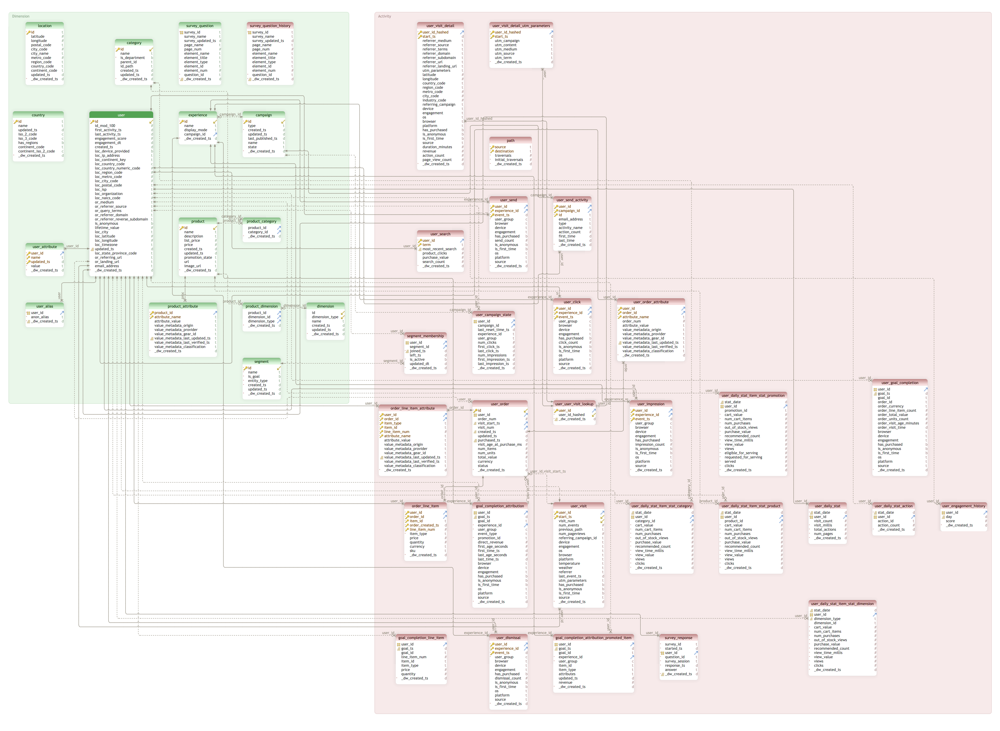
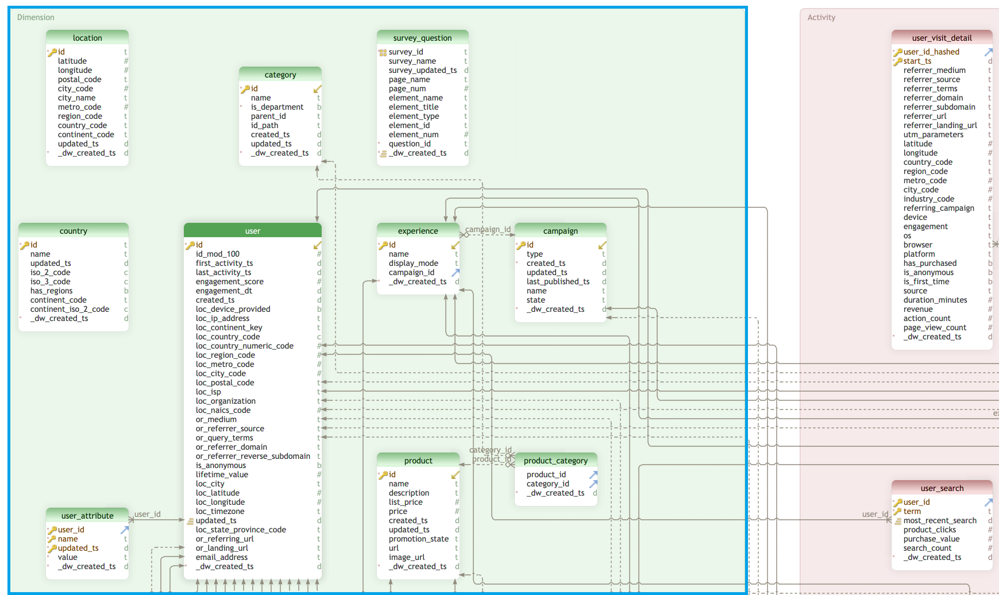
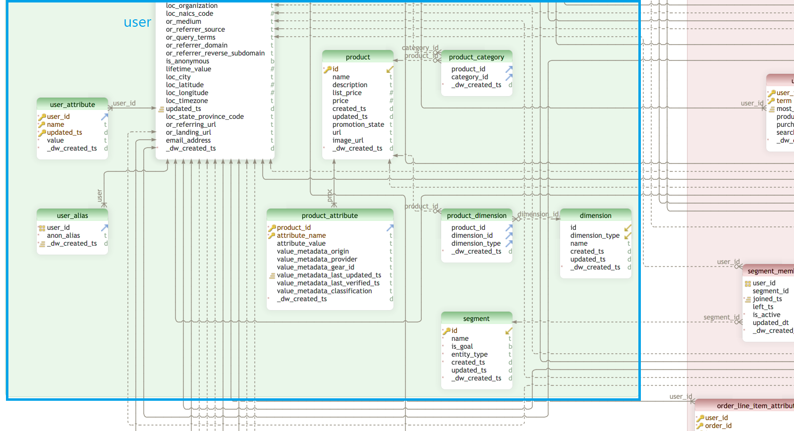
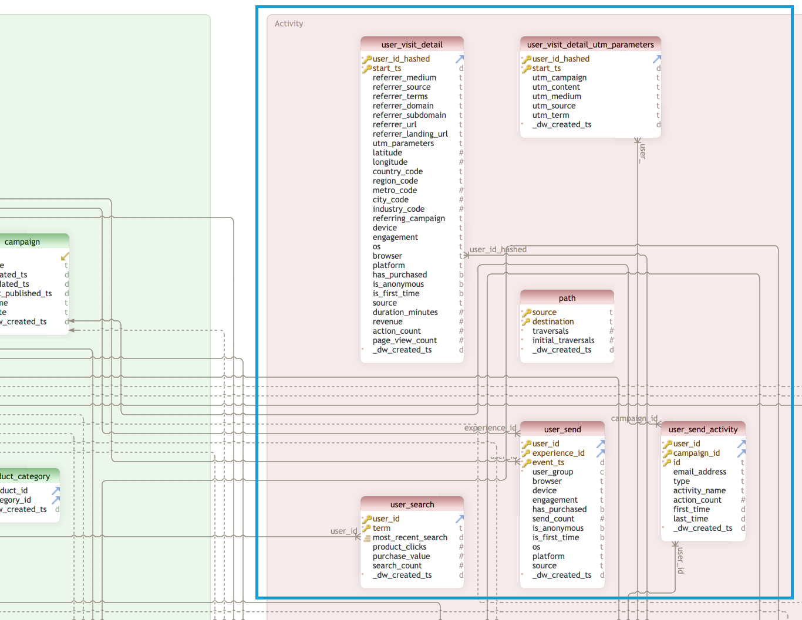
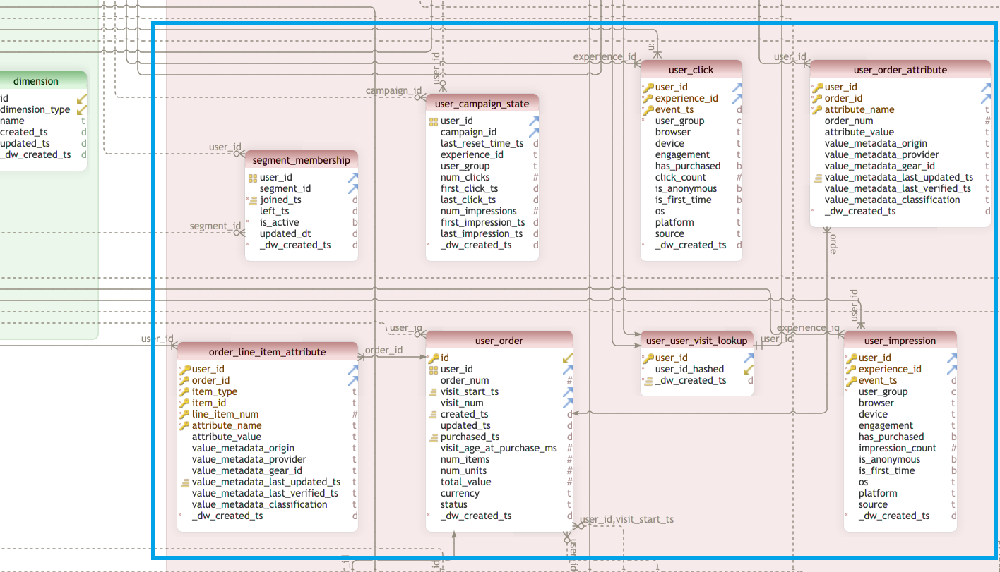
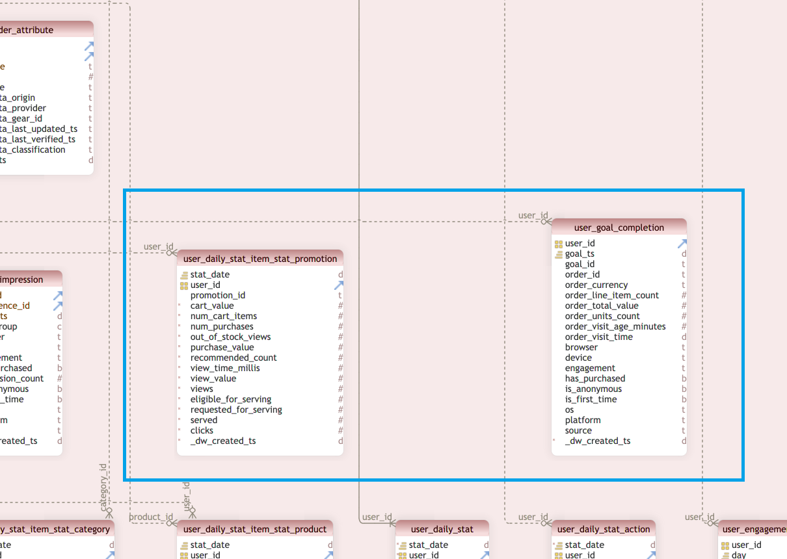
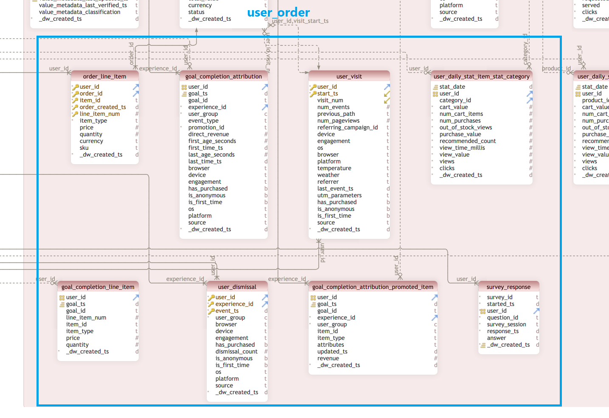
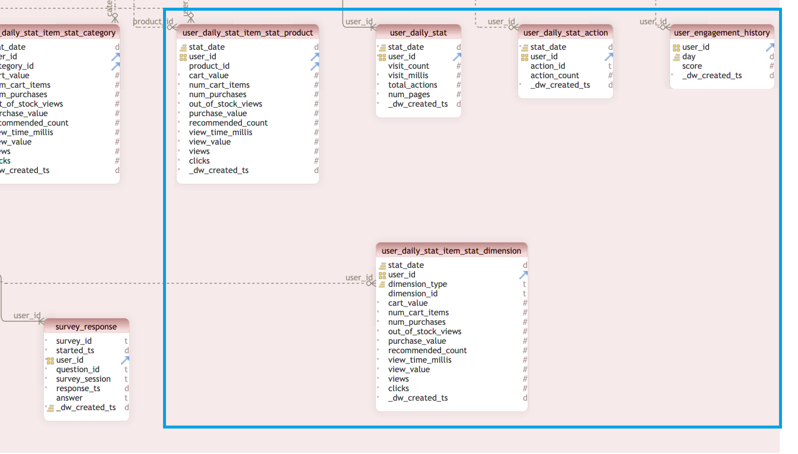

The Interaction Studio data warehouse makes it possible for business analysts to connect BI tools to Interaction Studio, and for data scientists to analyze and enhance Interaction Studio data as well as leverage the power of machine learning.

#### Article Topics
This article discusses the following topics related to the Interaction Studio data warehouse:
* Physical Data Model Entity Relationship Diagram (ERD)
* Data Warehouse Dimensions
* Data Warehouse Activity (Fact) Tables

## Physical Data Model ERD
The ERD below shows the relationships between the **Dimension** and **Activity** (Fact) tables of the Interaction Studio data warehouse. The [Data Dictionary](/data-analytics/data-dictionary) article provides the complete data specifications on these tables in alphabetical order. 

### ERD Details
Because of the size of the full Data Warehouse model, "ERD Detail" sections are provided at the end of each of the dimension and activity table sections for clarity. These sections present just the portion of the Data Warehouse ERD discussed. These "detail" sections show the following information for the tables in the ERD:
* Table name
* Field names
* Field data types (d=date, #=number, t=text/string, b=boolean, c=code)
* Primary Keys (indicated by key icon)
* Foreign Keys (indicated by "up-and-out" arrow)
* Fields used as Foreign Key by other tables (indicated by "down-and-in" arrow)

## Data Warehouse Dimensions
The dimension tables in the default Interaction Studio data warehouse provide the context for data analysis in the following dimensions:
* User
* Product
* Campaign
* Location
* User Segment
* Customer Survey

### Tables by Dimension
The following sections present the data warehouse tables used to store data for each dimension.

#### User
The dimension tables that store data associated with the User dimension include the following:
* user
* user\_attribute
* user\_alias

#### Product
The dimension tables that store data associated with the Product dimension include the following:
* product
* product\_category
* category
* product\_attribute
* product\_dimension
* dimension

#### Campaign
The dimension tables that store data associated with the Campaign dimension include the following:
* campaign
* experience

#### Location
The dimension tables that store data associated with the Location (affiliate) dimension include the following:
* location
* country

#### User Segment
The **segment** dimension table stores data associated with the specific segment for which a user has qualified.

#### Customer Survey
The **survey\_question** dimension table stores data associated with the customer survey questions that exist in the current system.

### ERD Detail - Dimensions
The following sections present the tables in the **Dimension** side of the data warehouse ERD broken into top and bottom sections.

#### ERD Detail - Dimension Top  

#### ERD Detail - Dimension Bottom  

## Data Warehouse Activity (Fact) Tables
The following sections list the activity (fact) tables in the default Interaction Studio data warehouse that collect and store the values used with dimension tables analysis. The tables are presented in the order in which they appear in the **Activity** side of the ERD shown in this article (left-to-right, top-to-bottom). The **ERD Detail** section at the end of each of the following subsections presents the ERD sections with the table details corresponding to those listed in that subsection.

### Activity Tables - ERD Top
The activity tables in the top portion of the ERD Activity side include:
* user\_visit\_detail
* user\_visit\_detail\_utm\_parameters
* path (affiliate)
* user\_search
* user\_send
* user\_send\_activity

#### ERD Detail - Activity Top

### Activity Tables - ERD Middle-Left
The activity tables in the middle-left portion of the ERD Activity side include:
* segment\_membership
* user\_campaign\_state
* user\_click
* user\_order\_attribute
* order\_line\_item\_attribute
* user\_order
* user\_user\_visit\_lookup
* user\_impression

#### ERD Detail - Activity Middle-Left

### Activity Tables - ERD Middle-Right
The activity tables in the middle-right portion of the ERD Activity side include:
* user\_daily\_stat\_item\_stat\_promotion
* user\_goal\_completion

#### ERD Detail - Activity Middle-Right

### Activity Tables - ERD Bottom-Left
The activity tables in the bottom-left portion of the ERD Activity side include:
* order\_line\_item
* goal\_completion\_attribution
* user\_visit
* user\_daily\_stat\_item\_stat\_category
* user\_daily\_stat\_item\_stat\_product
* goal\_completion\_line\_item
* user\_dismissal
* goal\_completion\_attribution\_promoted\_item
* survey\_response

#### ERD Detail - Activity Bottom-Left

### Activity Tables - ERD Bottom-Right
The activity tables in the bottom-right portion of the ERD Activity side include:
* user\_daily\_stat\_item\_stat\_product
* user\_daily\_stat
* user\_daily\_stat\_action
* user\_engagement_history
* user\_daily\_stat\_item\_stat\_dimension

#### ERD Detail - Activity Bottom-Right
