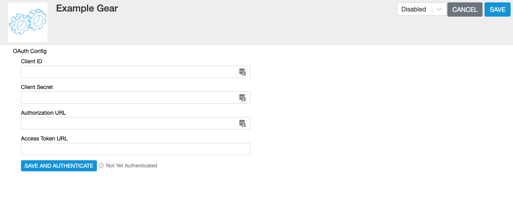

The OAuth component is used to configure a Gear for authentication of outgoing HTTP network requests to services using the OAuth 2.0 standard. [Configuration](/interface-config) can be exposed to the Gear end user using the [GearLifecycle](/gears/components/lifecycle) component allowing them to fill out credentials using a web form. Once configured the OAuth component can be referenced in calls to the [HTTP service](/gears/system-services/http) to authenticate requests. For documentation on all available methods see the [OAuthComponent API Typedoc](http://evergage-gears-docs.s3-website-us-east-1.amazonaws.com/core/interfaces/oauthcomponent.html).


## Authorization Setup

You'll typically have to configure the remote system to accept Interaction Studio for OAuth requests. When prompted for an OAuth callback or redirect URL, supply the following:

```
https://login.evergage.com/oauthredirect
```

It is a best practice to provide a Gear configuration page that explains how a user installing your Gear should configure OAuth in any connected systems. Remember to show them the proper callback URL and provide direct links into the remote platform for where the Interaction Studio OAuth app can be configured. 

#### Example
`OAuthExample.ts`
```typescript
export class OAuthExample implements OAuthComponent {
    @title("Client ID")
    clientId: string;

    @title("Client Secret")
    @secret(true)
    clientSecret: string;

    @title("Authorization URL")
    authorizationUrl: string;

    @title("Access Token URL")
    accessTokenUrl: string;

    getGrantOptions(context: OAuthComponentContext): OAuthGrantOptions {
        return {
            clientId: this.clientId,
            clientSecret: this.clientSecret,
            authorizationUrl: this.authorizationUrl,
            accessTokenUrl: this.accessTokenUrl,
            requestedAccessTokenScope: null,
            clientAuthentication: "HttpBasicAuthentication",
            accessTokenRequestMethod: "POST",
            accessTokenResponseFormat: "Json"
        }
    }

    getTokenUsage(context: OAuthComponentContext): TokenUsage {
        return "BearerAuthorizationHeader";
    }
}
```

### Exposing Authentication Options
Expose the authentication options to end users using the [Gear Lifecycle](/gears/components/lifecycle) component.
#### Example

`GearLifecycle.ts`
```typescript
import { OAuthExample } from "./OAuthExample"

export class GearLifecycle implements GearLifecycle {
    @description("OAuth Config")
    @title("OAuth Config")
    oAuth: OAuthExample;
}
```

With the OAuthComponent exposed on the lifecycle, the resulting configuration page should look something like this:



