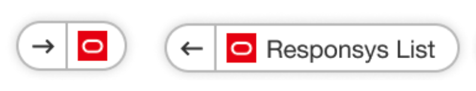
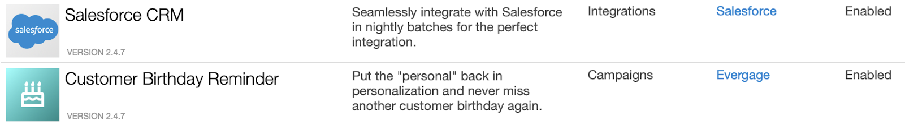
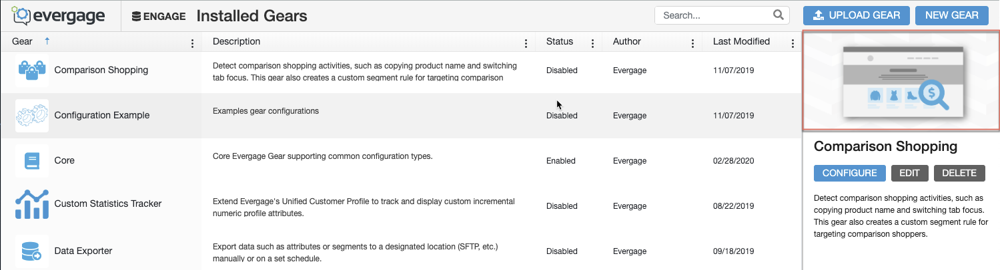

Every gear has an **evergage-gear.json** file that contains the metadata associated with that gear. This article lists the different kinds of Interaction Studio gear metadata along with their purpose, usage and formatting guidelines.

#### id
The unique identifier for the gear, also referred to as the "gear id."
- Acceptable characters: letters, numbers, and dashes only. 
- Case: all lowercase letters
- Separator: hyphens between words (kebab-case)
- Length: 2-3 words

Example: `comparison-shopping`

#### name
The name of the gear that will be displayed to users. This will appear in the Gears Marketplace and the Gears List screen within the platform.
- Case: initial caps
- Separator: spaces between words 
- Length: 2-3 words
- Refrain from using the word "gear" in the name

Example: `Comparison Shopping`

#### description
A brief description of what the gear is capable of doing. This will be displayed in the Gears Marketplace and the Gears List screen within the platform.
- Length: 1-3 sentences

#### url
A link to the gear developer's own website. 
- Interaction Studio developers should leave this as `null`.

#### category
The category the gear falls into. 
- As of this writing, the Gear categories are: "Connector", "ETL", and "Feature"  

#### author
The author of the gear, which is displayed on the Gears List screen.
- Interaction Studio developers should use "Interaction Studio"
- External developers should use their First and Last name

#### beaconExtensions
An array of beacon extensions contained inside the gear. 
- The values in the array should be strings and should match the file names of the extensions.

#### faviconImageUrl*
A favicon image that is displayed in other areas of the platform where the gear is in use. For example, the Segment List screen.
- Recommended Size: 32x32 (High DPI)
- Acceptable Formats: PNG, JPG, SVG or ICO
- Maximum file size: 50KB

*Example Usage*

    

#### iconImageUrl*
The square image that is displayed as the main image in the Gear List screen and the secondary image in the Gears Marketplace (see Example Usage, below).
- Recommended Size: 200x200px (High DPI)
- Logomark is recommended for this on a white background or knockout of logomark on a colored background. Image can but doesn’t have to match the Favicon.
- Acceptable Formats: PNG, JPG, or SVG
- Maximum File size: 150KB

*Example Usage*

*Gears List Screen:*

*Gears Marketplace Card:*

    

#### featureImageUrl*
This image is displayed as the main image in the Gears Marketplace and the preview image in the Gears List screen.
- Recommended Size: 600x300px (High DPI)
- Full Logo is recommended for Featured Image on a white background, SVG, PNG or JPG acceptable.
- For images, PNG or JPG are preferred file types.
- Maximum File size: 250KB

*Example Usage*

*Gears List Screen:*

*Gears Marketplace Card:*

    

\* The recommended location for gear images is directly within the gear directory itself, not nested within any other directories.

