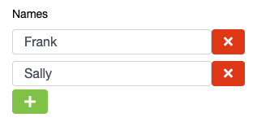
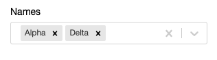
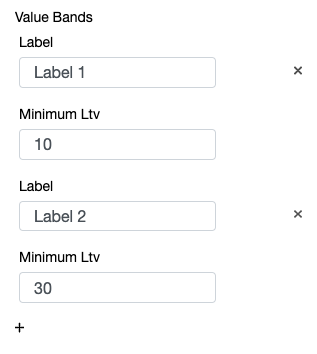

Certain properties can be declared as an array, allowing the input to be multi-select. This returns all selected values within an array.

| Property Type | Supported As Array |
| ------------- | -------------------|
| boolean | &#10060;|
| string | &#9745; |
| number | &#9745; |
| Color | &#10060;|
| DateTime | &#9745; |
| Complex Object | &#9745; |
| Select | &#9745; |
| Typed List | &#10060;|

---
#### Simple Types
Simple types can be put into multi-value arrays by simply making them arrays.

```ts
    names: string[];
```
 

String literal types can also be used as multi-value to provide the end-user with a set of options of which multiple can be selected.
```ts
    names: ("Alpha"|"Beta"|"Gamma"|"Delta")[];
```
 
---
#### Arrays of Complex Objects
Configurations can also be arrays complex objects. This can be used to permit the user to create a list of configured objects. When utilized in combination with the "tabular" decorator, it is possible to create table structured inputs.

```ts
export class LTVBands {
    label : string;
    minimumLtv : number;
}

export class LifecyclesLifecycle implements GearLifecycle {
    @tabular(true)
    valueBands: LTVBands[];
}
```
 