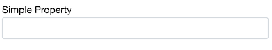

The Gears config system enables the development of custom interface configurations to users of the Interaction Studio UI. With this system, a Gear developer can tailor the setup interface for business requirements. These custom interface configurations can be used in the development of Interaction Studio Campaign Templates as well as configuration screens within the Gears system.

### Configurable types
The following Gear types support configuration:
* GearLifecycle
* SegmentExporter
* UserSegmentRule
* AccountSegmentRule
* ContextualRule
* CampaignTemplate

The specification of configuration inputs is done by adding properties to the configurable component. Configuration types can also be shared with CampaignTemplate gears so that templates can use the configuration objects from gears providing campaign services. For example, the RecommendationConfiguration class provides the user interface for users to configure the use of calls to the recommendation service.

### Configuration Properties

Configurable types have child properties that are rendered into the UI in the order they display in the page. Property types define the inputs that are rendered. The following example defines a single text input box with the Title "Simple Property". Form field titles are automatically uncamel-cased. 

```ts
export class SimpleTemplate implements CampaignTemplate {
    simpleProperty : string;
}
```
