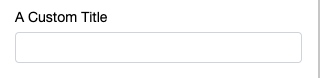
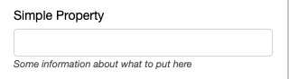
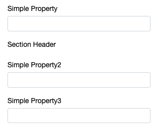
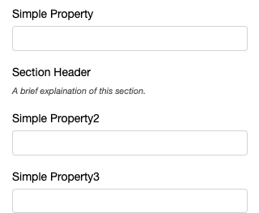
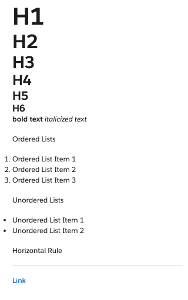

### Title
The label for the input, to be used instead of the default title case conversion of the property name.

```ts
@title("A Custom Title")
simpleProperty : string;
```
 

---
### Subtitle
A subtitle for the input.

```ts
@subtitle("Some information about what to put here")
simpleProperty : string;
```
 

---
### Units
See [Number Property](/interface-config/properties/number).

---
### Header
Will add a header before the decorated property, indicating all properties below this decorator (until the next header) are intended to be a section on configurables.

```ts
simpleProperty : string;

@header('Section Header')

simpleProperty2: string;

simpleProperty3: string;
```
 
_In the above example, simpleProperty2 and simpleProperty3 fall under the header 'Section Header'._

---
### Header Subtitle
Additional text to describe a section, can be used to provide the end user with instruction.

```ts
simpleProperty : string;

@header('Section Header')
@headerSubtitle('A brief explaination of this section.')

simpleProperty2: string;

simpleProperty3: string;
```
 

### Markdown
Basic Markdown rendered before the decorated property. Syntax limited to the examples provided below.

```ts
@markdown(`
# H1
## H2
### H3
#### H4
##### H5
###### H6

**bold text**
*italicized text*

Ordered Lists

1. Ordered List Item 1
2. Ordered List Item 2
3. Ordered List Item 3


Unordered Lists

- Unordered List Item 1
- Unordered List Item 2


Horizontal Rule

---

[Link](https://www.salesforce.com/)
`)
simpleProperty : string;
```



---
### Optional
Flags a property as optional. By default all properties are required.

```ts
@optional(true)
simpleProperty : string;
```

---
### Hidden
Hides the input from the user.
```ts
@hidden(true)
simpleProperty : string;
```
This decorator can also accept a function, in order to hide configurables conditionally. The arguments for the decorator are 'this', and a function whose first argument is self, the instance of this class.

The function MUST return boolean true or false, returning a non-boolean truthy or falsy value (e.g. 0, 1, 'some string') will thrown an error.

```ts
simpleBoolean : boolean;

@hidden(this, (self) => self.simpleBoolean)
conditionalField: string;
```

---
### Shown If
The inverse of hidden, displays the field if true, hides the field if false.
```ts
@shownIf(true)
simpleProperty : string;
```

```ts
simpleBoolean : boolean;

@shownIf(this, (self) => self.simpleBoolean)
conditionalField: string;
```

---
### Rich Text
See [String Property](/interface-config/properties/string).

---
### Options
See [Select Property](/interface-config/properties/select).

---
### Button Group
Renders a static list of options as a button group.
```ts
@buttonGroup(true)
simpleOption : "option1" | "option2" | "option3";
```

---
### Range
See [DateTime Property](/interface-config/properties/datetime).

---
### Tabular
Displays the fields of a complex object horizontally.
```ts
@tabular()
complexObject : SomeComplexType;

```
Arrays of complex objects are rendered like a table. Include `headersPerRow: true` to show field titles on each row. Optionally render a line to visually divide each row by including `dividerLine: true`.

```ts
@tabular({dividerLine: true, headersPerRow:false})
complexObjectList : SomeComplexType[];
```
---
### Group

