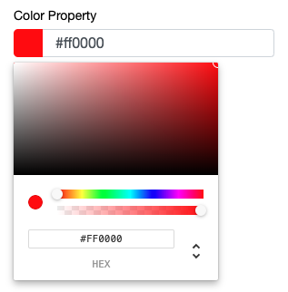

#### Color Picker
A basic color picker input.
```ts
colorProperty: Color;
```
 
The value returned from the selection contains both the hex value and the rgb value. 

The object structure is as follows:
```ts
{
    hex: string,
    rbg: {
        r: number,
        b: number,
        g: number,
        a: number
    }
}
```