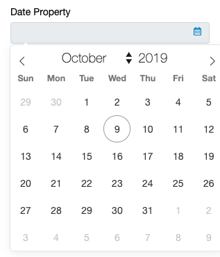

#### Date Picker
A date picker input.
```ts
dateProperty: DateTime;
```
 
The value returned from the selection is structred as an object with a single "dateTime" property. The property is an array of strings representing the date and time in ISO 8601 format (e.g. 2019-10-08T16:00:00.000Z).

The object structure is as follows:
```ts
{
    dateTime: string[]
}
```
_Note that even if the DateTime picker only intends to return a single date, it will still return an array._

---
#### Date Range
The picker can be configured to return a range using the range decorator.
```ts
@range(true)
dateProperty: DateTime;
```
In this case, the returned array value will have the start of the range in the 0 index of the array, and the end of the range in the 1 index.

---
#### Multi-Select
The picker can be configured to select multiple dates by setting the type as an array.
```ts
dateProperty: DateTime[];
```
_See [Array Properties](/interface-config/arrays) for more examples of multi-select properties_