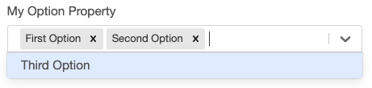
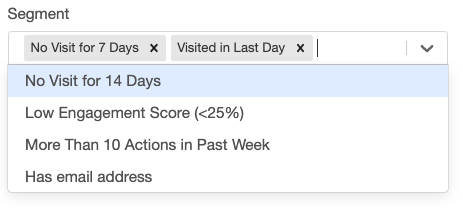

---
#### Simple Multi Select
Multi Select input properties are configured similarly to [Select Properties](/interface-config/properties/select) by using an @options, @lookupOptions or @searchOptions decorator. The only difference is the property will be defined as an array.

```ts
export class SimpleTemplate implements CampaignTemplate {
    @options(["First Option", "Second Option", "Third Option"])
    myOptionProperty: string[];
}
```
 

---
#### Complex Types As Option Values
This works with complex types as well. 

```ts
export class ComplexType {
    firstProperty: string;
    secondProperty: number;
    label: string;
}

export class SimpleTemplate implements CampaignTemplate {
    @options([
        {firstProperty: "one", secondProperty: 1, label: "First Option"},
        {firstProperty: "two", secondProperty: 2, label: "Second Option"},
        {firstProperty: "three", secondProperty: 3, label: "Third Option"}
    ])
    myOptionProperty: ComplexType[];
}
```
 

#### Dynamic Option Values
An example of a multi select with dynamic options.

```ts
export class SegmentReference {
    value: string;
    label: string;
}

export class SegmentLookup implements Lookup<SegmentReference> {
    lookup(context: GearLifecycleContext): SegmentReference[] {
        let segments = context.services.config.findSegments("User");

        return segments.map( segment => {
            return <SegmentReference>{ value : segment.id, label : segment.name };
        });
    }
}

export class SimpleTemplate implements CampaignTemplate {
    @lookupOptions(() => new SegmentLookup())
    segment : SegmentReference[];
}
```
 