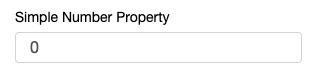
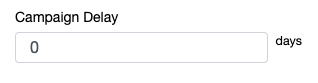
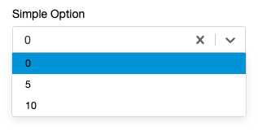

#### Simple Number Input
A basic numeric input
```ts
simpleNumberProperty : number = 0;
```
 

---
#### Units Decorator
Units can be displayed next to a numeric input using the units decorator.
```ts
@units("days")
campaignDelay : number = 7;
```
 

---
#### Enumerated Values
A static list of options can be provided using the TypeScript _String Literal_ type system. This provides a drop-down menu with the options.
```ts
simpleOption : 0 | 5 | 10;
```

Alternatively, a static list of options can be provided using an options decorator.
```ts
@options([0, 5, 10])
simpleOption: number;
```
 
_See [Select Property](/interface-config/properties/select) for more complex dropdown examples._

---
_Related: [Select Proprety](/interface-config/properties/select), [Arrays](/interface-config/arrays)_