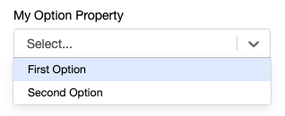
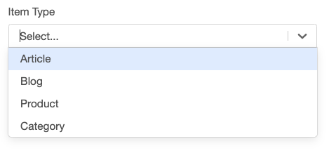
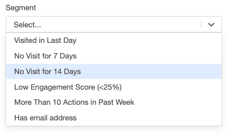
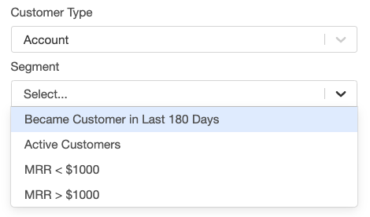
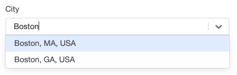

#### Basic Dropdown
See Enumerated values within [String](/interface-config/properties/string) and [Number](/interface-config/properties/number).

---
#### Complex Types As Option Values
Static values for complex configurations can be defined such that they appear as options within a drop-down menu by using the options decorator. If the complex type contains a "label" property, it will be used for the option's label.

```ts
export class ComplexType {
    firstProperty: string;
    secondProperty: number;
    label: string;
}

export class SimpleTemplate implements CampaignTemplate {
    @options([
        {firstProperty: "one", secondProperty: 1, label: "First Option"},
        {firstProperty: "two", secondProperty: 2, label: "Second Option"}
    ])
    myOptionProperty: ComplexType;
}
```
 


---
#### Simple Dynamic Option Values
Dynamic options can be loaded using the @lookupOptions decorator. If the options value is a string, the value will be used as the label.

```ts
export class ItemTypeLookup implements Lookup<string> {
    lookup(context: GearLifecycleContext): string[] {
        return context.services.config.findEnabledItemTypes();
    }
}

export class SimpleTemplate implements CampaignTemplate {}
    @lookupOptions(() => new ItemTypeLookup())
    itemType : string;
}
```
 

---
#### Dynamic Option Values
If the class has a 'label' property, this property will be displayed in the dropdown.

```ts
export class SegmentReference {
    value: string;
    label: string;
}

export class SegmentLookup implements Lookup<SegmentReference> {
    lookup(context: GearLifecycleContext): SegmentReference[] {
        let segments = context.services.config.findSegments("User");

        return segments.map( segment => {
            return <SegmentReference>{ value : segment.id, label : segment.name };
        });
    }
}

export class SimpleTemplate implements CampaignTemplate {
    @lookupOptions(() => new SegmentLookup())
    segment : SegmentReference;
}
```
 


---
#### Dynamic Option Values With Configuration
The Lookup class can passed data via a constructor to configure what the lookup method returns as options. 

```ts
type CustomerType = "User" | "Account";

export class SegmentReference {
    value: string;
    label: string;
}

export class SegmentLookup implements Lookup<SegmentReference> {
    customerType: CustomerType = "User";

    constructor(customerType: CustomerType) {
        this.customerType = customerType;
    }

    lookup(context: GearLifecycleContext): SegmentReference[] {
        if (!!this.customerType) {
            let segments = context.services.config.findSegments(this.customerType);

            return segments.map( segment => {
                return <SegmentReference>{ value : segment.id, label : segment.name };
            });
        }
    }
}

export class SimpleTemplate implements CampaignTemplate {
    customerType : CustomerType;

    @lookupOptions((self) => new SegmentLookup(self?.customerType))
    segment : SegmentReference;
}
```
 

---
#### Searchable Options
The @searchOptions decorator works similarly to @lookupOptions. The difference is that @searchOptions will provide a search string that can be used to filter applicable options.

```ts
export class CityReference {
    value: City;
    label: string;
    searchString: string;
}

export class CitySearch implements Search<CityReference> {
    search(context: GearLifecycleContext, searchString: string): CityReference[] {
        if (searchString) {
            let cities : City[] = context.services.geography.searchCities(searchString);
            return cities.map((c) => {
                return <CityReference>{ label: c.longName(), value: c };
            });
        }
    }
}

export class SimpleTemplate implements CampaignTemplate {
    @searchOptions(() => new CitySearch())
    city: CityReference;
}
```
 
