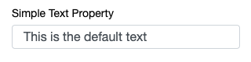
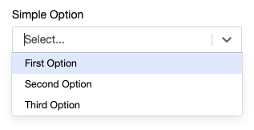
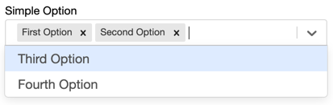
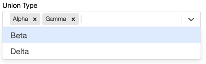
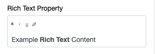

#### Simple Text Input
A basic text input.
```ts
simpleTextProperty : string = "This is the default text";
```
 

---
#### Enumerated Values
A static list of options can be provided using the TypeScript _String Literal_ type system. This provides a drop-down menu with the options.
```ts
simpleOption : "First Option" | "Second Option" | "Third Option";
```

Alternatively, a static list of options can be provided using an options decorator.
```ts
@options(["First Option", "Second Option", "Third Option"])
simpleOption: string;
```
 
See [Select Property](/interface-config/properties/select) for more complex dropdown examples.

#### Multi-Valued Properties

Simple fields can be made multi-valued capable by simply declaring their field types to be arrays.
```ts
@options(["First Option", "Second Option", "Third Option", "Fourth Option"])
simpleOption: string[];
```


#### Literal Types

For strong typing in your code, you can also use string literal types, including in array based multi-valued properties. 
These values will provide the available options to a drop-down just as the @options decorator.
```ts
unionType: ("Alpha" | "Beta" | "Gamma" | "Delta" )[]; 
```


---
#### Rich Text Input
Provides a rich text editor that outputs it's value as a string of HTML.
```ts
@richText(true)
richTextProperty : string = "Example <span style='font-weight:bold;'>Rich Text</span> Content";
```


---
_Related: [Select Proprety](/interface-config/properties/select), [Static Values](/interface-config/static-values), [Arrays](/interface-config/arrays)_
