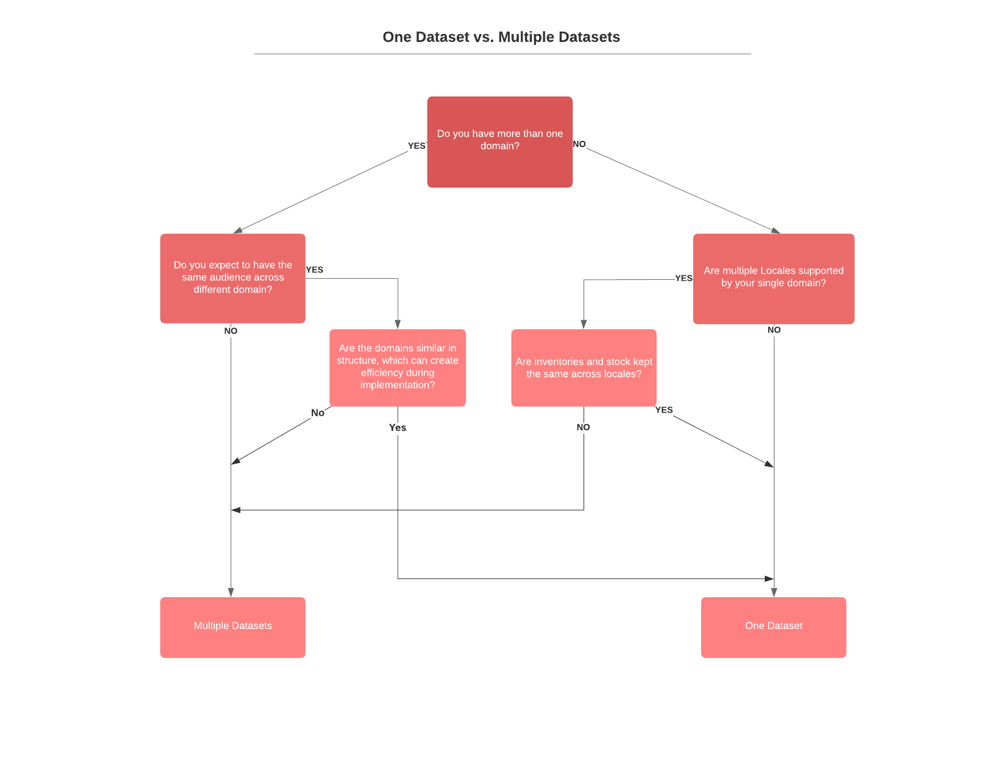

Interaction Studio accounts are similar to a Marketing Cloud tenants. Customers typically sign up for a single account for their license, and can have multiple datasets associated with each account — similar to Marketing Cloud business units.

Each dataset in IS is a separate, siloed data environment. Data is not shared between datasets, so the same user could have an independent profile in each dataset. Campaigns, segments, statistics, and integrations are also not shared between datasets. IS customers can also set permissions levels for their teams, ensuring that each team has access to the datasets they need to use Interaction Studio for their business needs.

It is common to have a single dataset associated with one web domain. However, it is possible to have more than one domain on an Interaction Studio license, or have a domain that serves multiple countries in multiple languages. In these cases, dataset design during the discovery process is an important step in a successful Interaction Studio implementation.


## What factors influence dataset design?


1. How many web domains are included in the license? Are they all the same brand, or are they different brands?
2. How many countries (or locales) does the domain(s) support?

    

### Multiple Domains

If there are multiple domains on one Interaction Studio license, either each domain should have a separate dataset or the domains could be combined into a single dataset. Often, it is best to have a single dataset per domain, but there are often good reasons to combine multiple domains into a single dataset. See below for guidance on using a single dataset for multiple domains.

## Designing the Catalog

Depending on the catalog differences between the different sites, there are some things to keep in mind when designing how the catalog data model will look. If the sites do share products with the same IDs, you may want to differentiate between these products by making the IDs unique per site. This could be done by prefixing the IDs that would be captured by a unique identifier for the site.

For example consider two sites, [websitea.example](http://websitea.example/) and [websiteb.example](http://websiteb.example/). These two sites share a product with the ID `abc123`

When importing and capturing catalog data you may want to prefix this product ID based on site to differentiate the product in the Interaction Studio Catalog since it could have different attributes depending on the site. On [websitea.example](http://websitea.example/) the ID could become `websitea_abc123` and on [websiteb.example](http://websiteb.example/) the ID could become `websiteb_abc123`.

To help differentiate products that exists on different sites in the same dataset, it is a good idea to track a dimension for the site the product appears on. This dimension would allow for differentiating products available only on the site the user is currently on in recipes. Consider the two sites [websitea.example](http://websitea.example/) and [websiteb.example](http://websiteb.example/). When viewing a product on [websitea.example](http://websitea.example/) you could set this dimension to `websitea.example` and when viewing a product on [websiteb.example](http://websiteb.example/) you could set this dimension to `websiteb.example`. Having this dimension available would allow adding a recipe exclusion to any recommendations so that only products available on the site the user is currently on would be recommended.


## Sitemap

When mapping multiple sites to the same dataset, these sites will share the same Web SDK and same Sitemap integration.

### Setting the Cookie Domain

By default, the cookieDomain set when initializing the Web SDK for tracking will be the current domain. If you need to configure the cookieDomain setting, you would need to dynamically determine which domain the cookie should be set on since the initialization would be shared between the different sites. This example shows how to dynamically determine and set a custom cookieDomain based on the site that the Web SDK is initializing for. The Interaction Studio Web SDK anonymous user IDs are generated separately for each domain. When integrating multiple domains in the same dataset, users that are tracked anonymously will be tracked as separate users across the different domains.

```js
const getCookieDomain = () => {
    let currentDomain = window.location.hostname;
    if (currentDomain === "websitea.example") {
        return "websitea.example";
    } else if (currentDomain === "websiteb.example") {
        return "websiteb.example";
    }
}
const currentCookieDomain = getCookieDomain();

Evergage.init({
    cookieDomain: currentCookieDomain
})
```

### Initializing the Correct Sitemap

When mapping multiple domains to the same dataset you will want to have separate Sitemap configs for each domain. This allows for configuring unique Page Types for each site. Once you have built the Sitemap configs for each domain, you will need to initialize the correct Sitemap config based on which domain the user is currently visiting. See the following example:


```js
const getCookieDomain = () => {
    let currentDomain = window.location.hostname;
    if (currentDomain === "websitea.example") {
        return "websitea.example";
    } else if (currentDomain === "websiteb.example") {
        return "websiteb.example";
    }
}
const currentCookieDomain = getCookieDomain();

Evergage.init({
    cookieDomain: currentCookieDomain
}).then(() => {

    let siteAConfig = {
        global: {},
        pageTypeDefault: {
            name: "default"
        },
        pageTypes: [
            {
                name: "home",
                action: "Example A Home",
                isMatch: () => window.location.pathname === "/"
            }
        ]
    };

    let siteBConfig = {
        global: {},
        pageTypeDefault: {
            name: "default",
        },
        pageTypes: [
            {
                name: "home",
                action: "Example B Home",
                isMatch: () => window.location.pathname === "/"
            }
        ]
    };

    if (currentCookieDomain === "websitea.example") {
        Evergage.initSitemap(siteAConfig);
    } else if (currentCookieDomain === "websiteb.example") {
        Evergage.initSitemap(siteBConfig);
    }
})
```

### Page Types and Content Zones

Make sure that the pageType names are consistent between the domains. A product detail page on [websitea.example](http://websitea.example/) and a product detail page on [websiteb.example](http://websiteb.example/) would both share the same `product_detail` page type. Actions and catalog items can differentiate which site the user is currently visiting.

While Content Zone selectors may be different between two different domains, Content Zone names should be consistent across domains. This will help facilitate the sharing of templates and campaigns.
