A Sitemap sends events to Interaction Studio based on the actions of the website visitors (users). There are several ways to validate whether the Sitemap configuration is properly recognizing the targeted user actions and sending the corresponding events. 
## Sitemap Events
Sitemap events are HTTP requests sent to Interaction Studio's Event API endpoint that describe the context of the page or a specific action a user performed on the site. Some examples include:

* Visiting a page
* Viewing a catalog item
* Submitting a form
* Adding an item to a shopping cart
* Purchasing an item
* Clicking a designated page area

## Sitemap Event Validation Tools and Methods
The tools and methods Sitemap developers can use to validate Sitemap events include:

* [Interaction Studio Sitemap Editor](#event-validation-using-the-sitemap-editor)
* [Interaction Studio Event Stream Report](#event-validation-using-the-event-stream-report)
* [Chrome Browser Developer Tools](#event-validation-using-chrome-browser-developer-tools)

The remainder of this article provides guidance for using each of these tools to validate a Sitemap.

## Event Validation Using the Sitemap Editor
As you develop a Sitemap, you can use the Sitemap Editor as described in the following sections to confirm that the JavaScript describing your events is valid and configured properly. 

### Sitemap JS Tab Code Check
The **Sitemap JS** tab where you enter your Sitemap JavaScript has a built-in code validator that will flag the presence of JavaScript syntax errors as highlighted in the following figure.

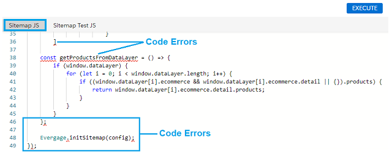

The **Logs** tab provides messages related to the JavaScript code errors flagged by the Sitemap JS code editor. However, you may want to use a more robust JavaScript validation tool to investigate JavaScript syntax issues and code execution errors flagged in the Sitemap JS code editor.

### Current Page Object Validation
The **Current Page** tab of the Sitemap Editor is shown below: 

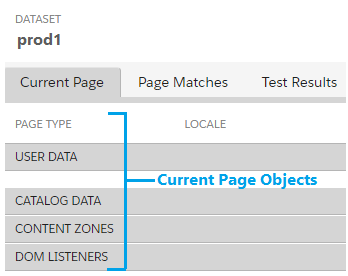
The **Current Page** tab will display all Sitemap objects configured and executed on the current page shown in the browser, including: 

* **Page Type:** Name of the configured page type of the currently displayed page
* **User Data:** ID of the current user browsing the page and any user-triggered events that are configured on the page. The user ID can be the user ID that is randomly generated for anonymous site visitors or a named user ID.
* **Catalog Data:** Names of Catalog objects configured on the current page.
* **Content Zones:** Names of Content Zone objects configured on the current page.
* **DOM Listeners:** Names of JavaScript DOM listeners configured on the current page.

#### Current Page Object Examples
The following figure shows an example of how Sitemap objects display in the **Current Page** tab with key functional areas indicated by numbers. The following sections describe the purpose and function of each area and are numbered corresponding to the numbers on the figure.

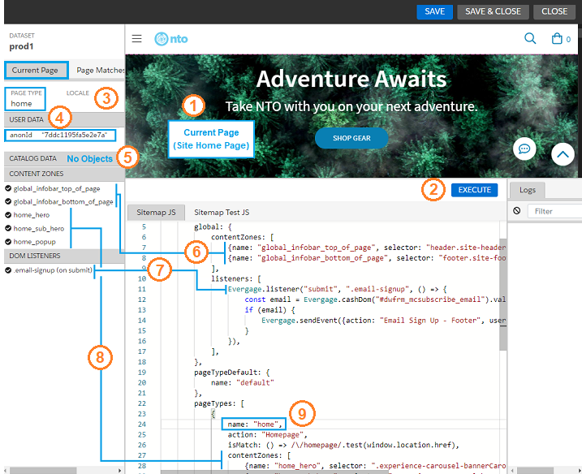

##### 1. Current Page (Site Home Page)
This area displays the current page of the target site that the Sitemap editor is targeting. The objects displayed in the **Current Page** tab will be the objects configured for the page type displayed here. In the above example, the browser used by the Sitemap editor is on the **Home** page of the target site, and has a `pageTypes` object called "home" configured in the Sitemap (**9**). 

##### 2. Execute (button)
Clicking the **Execute** button runs and validates the JavaScript entered in the **Sitemap JS** editor. Sitemap objects that resolve with the current page type or global configuration will display in the **Current Page** tab. Objects with invalid JavaScript will not display in the _Current Page_ tab.

##### 3. Page Type
This area displays the page type that matches the results of the `isMatch` function configured for the currently displayed page type. In the above example, the site **Home** page type (**1**) is matched by the `isMatch` function configured for the page type named `home` in the Sitemap (**9**).

##### 4. User Data
This area displays the user ID of the user visiting the current page as well as any user-triggered events configured in the Sitemap. The above example shows an anonymous user ID.

##### 5. Catalog Data
This area displays any `catalog` objects configured in the **Sitemap JS** for the currently displayed page. In the above **Home** page example, no `catalog` objects have been configured.

##### 6. Content Zones - Global
The above example shows that this Sitemap has two global Content Zones that are properly configured to display in the **Current Page** tab. Global content zones will be active in all configured page types.

##### 7. DOM Listeners
The above example shows that this Sitemap has a `listener` in the global configuration that that is properly configured to display in the **DOM Listeners** section of the **Current Page** tab. This `listener` will send an event to Interaction Studio when a user signs up for an email subscription.

##### 8. Content Zones - Page Type
The above example shows that this Sitemap has three Content Zones that are properly configured to display in the **Current Page** tab when the Sitemap editor is on the `home` page type.

##### 9. pageTypes: "home"
The above example shows that this Sitemap has a "home" page type configured to display in the **Page Type** section of the **Current Page** tab (**3**) when the Sitemap editor is on the `home` page type.

### Page Match Validation
The **Page Matches** tab displays the currently matched page type as well as all other page types configured in the Sitemap. The currently matched page displays with a "checkmark" icon, while the other configured page types display with a "backslash" icon to indicate they were not matched as the current page. 

The following figure shows an example of the **Page Matches** tab where the **home** page is the currently matched page as well as several other pages that are configured in the Sitemap JS editor but are not matched as the current page.

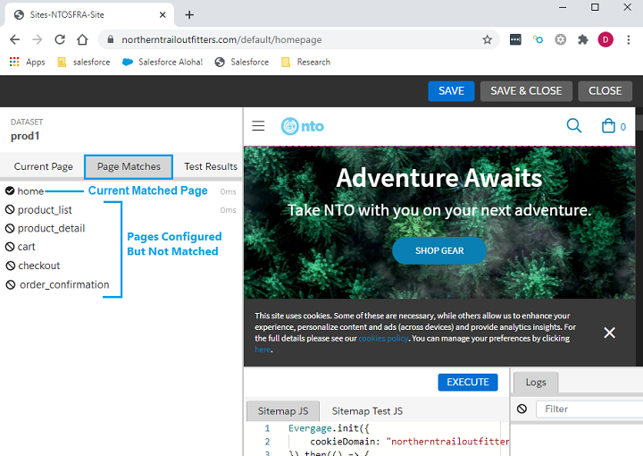

## Event Validation Using the Event Stream Report
The Interaction Studio **Event Stream** report displays all events received by Interaction Studio, including events sent from the Sitemap as well as from other sources. 
### Accessing the Event Stream Report
To access the _Event Stream_ report, do the following:
1. Login to Interaction Studio.

    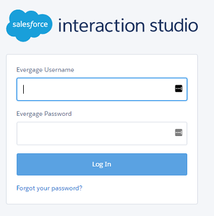
2. In the **Dashboard**, use the dataset pull-down menu select the dataset that contains the events you want to see.

    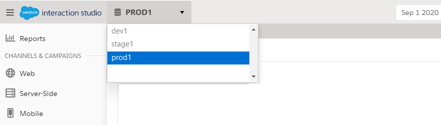 

3. Hover over **Reports** on the left menu to display the reports popup menu, and select **Event Stream** from the _Activity_ section of the menu.

    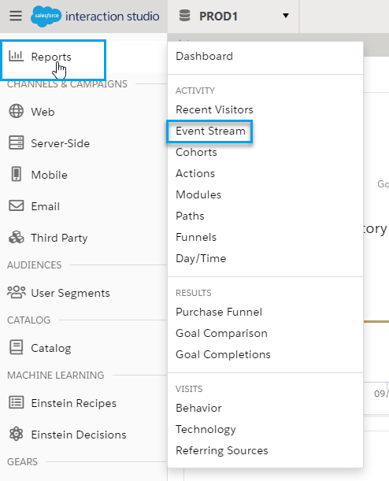

### Example: Event Processing and Display in the Event Stream
The Sitemap JavaScript is configured to send events to Interaction Studio based on the actions by site visitors. This section presents an example based of an anonymous user who decides to sign up for emails from the company (thus becoming "known"), and then chooses to browse the Men's section of the website.
#### JavaScript Listener for Email Sign-Up
The following shows an example of a JavaScript listener configured to send an event when a user signs up for email. The sign-up form appears on the bottom of every page in the site so this listener should be configured as part of the `global` configuration.

            listeners: [
                Evergage.listener("submit", ".email-signup", () => {
                    const email = Evergage.cashDom("#dwfrm_mcsubscribe_email").val();
                    if (email) {
                        Evergage.sendEvent({action: "Email Sign Up - Footer", user: {id: email} });
                    }
                }),
            ]

#### Site UI for Email Sign-Up
The following shows an example of a site email sign-up form being completed by "Joe Customer". With the JavaScript listener configured as shown in the preceding section, an event will be sent to Interaction Studio and show up in the _Event Stream_ when a user provides their email address and clicks the submit button (**->**). 

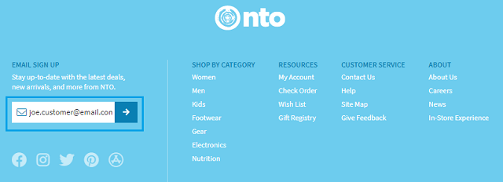

#### Events Displayed in the Event Stream Report
If the email signup listener is properly configured in the Sitemap, when "Joe Customer" provides his email and clicks **Submit**, the event will show up immediately in the Interaction Studio _Event Stream_ report. This report provides the following information and functionality:

* Event stream search
* Event stream table
* Event details for individual events

The following figure shows an example of the events sent to Interaction Studio before and after Joe Customer submitted his email in the email sign-up form. The following sections describe the information and functionality provided by the _Event Stream_ report.

> **Note:** See [Understanding the Event Stream](https://doc.evergage.com/display/EKB/Understand+the+Event+Stream) for more information on the available functionality in the Event Stream report.

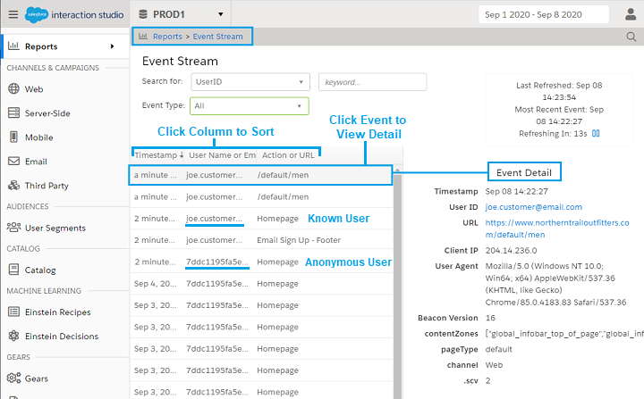

##### Event Stream Search
In the Event Stream search area, you can search for and filter the Event Stream table to display only events that were generated by a specific UserID/User Name or email address. This is done as follows:

1. In the **keyword** field, enter text that matches characters in the user name or email address for the user whose events you want to see. 
2. As soon as you enter characters that match an existing user name or email address, the matching user name(s) will display. 
3. Click the desired user. The Event Stream table will now display only the events for that user. 
4. If you want to see only events of a specific type, click the **Event Type** pull-down menu and select the desired type.

##### Event Stream Table
The _Event Stream_ table lists event data for all events triggered by the Sitemap and other event sources from other systems in the Interaction Studio integration. The data in the _Event Stream_ table is refreshed every 15 seconds and includes:
* **Timestamp:** Time or date that the event occurred. Events triggered on the current day will have a timestamp of how many minutes/hours ago the event was triggered. Events triggered the day before the current day will have a timestamp of "yesterday". Earlier events will have a timestamp of the date the event was triggered. 
* **User Name or Email:** User name or email address of the user who triggered the event.
* **Action or URL:** Name of the action for which the event was triggered or the URL of the page which the user visited that triggered the event. 

*Modifying the Event Stream Data View*

The _Event Stream_ table provides the following functionality to modify how the data in the table displays:
* Click a column heading in the _Event Stream_ table to sort the table by the data in that field. 
* Click the same column heading more than once to toggle between an ascending/descending data sort.
* Click an individual event entry in the table to display the details for that event as described in the following section.

##### From Anonymous to Known User
The example shown in the following figure shows what happens after "Joe Customer" submits his email address. The anonymous user `7ddc1195...` changes to the known user `joe.customer@email.com`. This happens any time an anonymous user identifies themselves through an action like email submission or log in. Interaction Studio associates the anonymous ID with the known user and adds the browsing behavior of the anonymous ID to the [Unified Customer Profile](https://doc.evergage.com/display/EKB/Unified+Customer+Profile) of the known user. A known user may have many associated anonymous IDs (and more than one known user name) depending on their browsing habits on the site. 

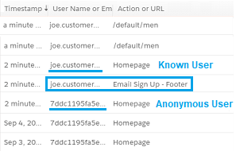

>**Note:** The figure above is presented for example only. In large environments with hundreds or thousands of simultaneous visitors you will not be able to visually associate the anonymous user ID with their known user name.

##### Individual Event Details
When you click an individual event in the Event Stream table, the details for that event will display in the **Event Detail** area to the right of the Event Stream table. 

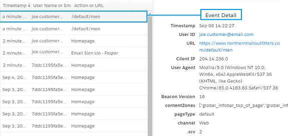

As shown in the above figure, the details provided in the **Event Detail** area for the selected individual event include:

* **Timestamp:** Date and time that the event was triggered.
* **User ID:** User name, email address, or anonymous user ID of the user who triggered the event.
* **URL:** Page on which the user generated the event. 
* **Client IP:** IP address of the user client that generated the event.
* **User Agent:** User Agent (UA) string sent in the HTTP header with browser requests that typically identifies the browser type, browser version, and browser host operating system. 
* **Beacon Version:** Version of the JavaScript Beacon that sent the event.
* **contentZones:** Content Zone in the Sitemap on which the event was generated. The above figure shows an event that was triggered when a user clicked in a Sitemap Content Zone called `global_infobar_top_of_page`.
* **pageType:** The type of page that the user accessed. The above figure shows the event of a user accessing the "Men's" category page of a retailer. This page has no configured page type in the Sitemap, so the pageType value is `default`.
* **channel:** The engagement channel that generated the event. For Sitemap-generated events, the channel will always be `Web`.
* **.scv:** The Sitemap Configuration Version (SCV) is incremented every time changes to the Sitemap are saved. This value is used internally by Interaction Studio to prevent conflicts with events sent from earlier Sitemap versions. 

## Event Validation Using Chrome Browser Developer Tools
Sitemap developers can also validate Sitemap events using the Google Chrome browser's built-in developer tools as described in the following sections.

### Viewing Page Load Events
The simplest way to view events that are triggered by page load is to run the `Evergage.getCurrentPage` command from the Chrome **Console** developer panel. However, this command will not display events that are triggered after page load. To run this command, do the following:

1. Close out of the Interaction Studio Sitemap Editor.
2. Browse to the site page containing the events you want to validate.
3. Open the Chrome Developer Tools and navigate to the **Console** panel.
4. Run the following command:

    `Evergage.getCurrentPage()`

The following figure shows an example of the results of running the `Evergage.getCurrentPage` command.

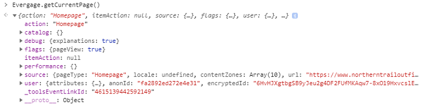

### Validating Individual Event Configurations
In the Chrome **Network** developer panel, you can see all events generated on the current page, including those generated after page load. This can be done as follows:

1. Close out of the Interaction Studio Sitemap Editor.
2. Browse to the site page containing the events you want to validate.
3. Take an action on the page that you expect to generate an event.
4. Open the Chrome Developer Tools and navigate to the **Network** panel.
5. Find and select the event. The event will have the name of your dataset followed by a question mark (?) and the word "event".
6. Select the event and select the **Headers** panel to view the event. Events are sent from the Sitemap to Interaction Studio as JSON GET requests. The events are converted to Base 64 and appended to the request URL as shown in the following figure. 

    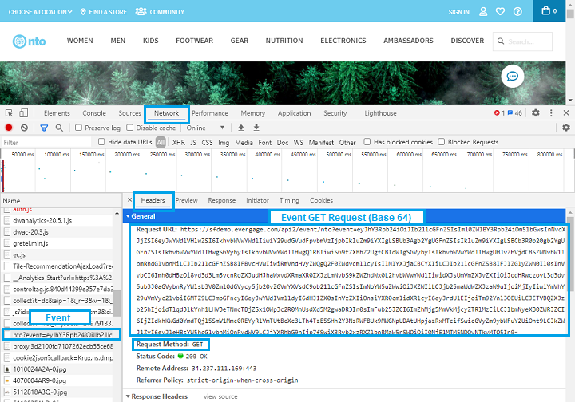

7. Copy the event GET request starting immediately after the `event=` to the end as highlighted in the figure below.

    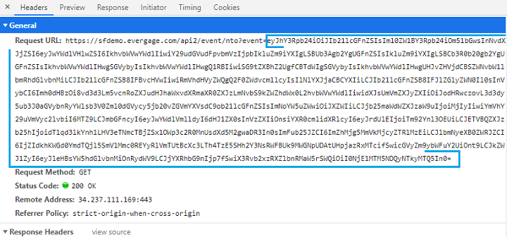

8. Navigate to the Chrome **Console** developer tool. Run the `atob` command to convert the event back to JavaScript objects. You can run the `JSON.parse` command in combination with the `atob` command to return the event JavaScript formatted. The syntax for running this command is as follows:

    `JSON.parse(atob("<Event text in Base 64>"))` 

    The following figure shows an example of this command and the results returned.

    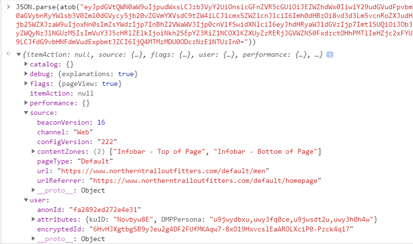

9. Review the event and confirm it contains the expected objects.

