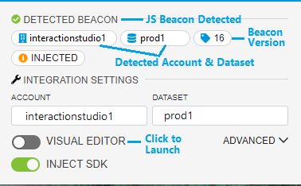
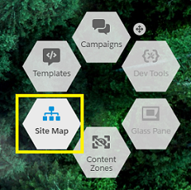
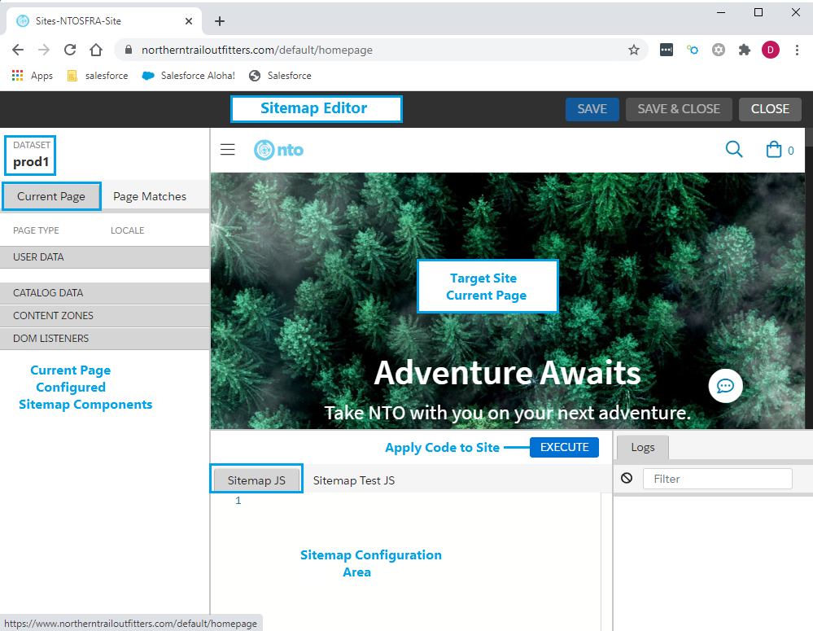

A Sitemap is a configuration-driven system deployed by and executed within the Interaction Studio JavaScript Web SDK. The Sitemap configuration data exposes the ability for other parts of the Interaction Studio platform to register and receive events from the client context. This article presents guidance to Sitemap developers for configuring the JavaScript components of a Sitemap required to implement the Interaction Studio web channel solution architecture. For a more complete introduction to the Sitemap, see [Sitemap Overview](/web-integration/sitemap).

## Sitemap Development Process
To develop a Sitemap, do the following:

1. Navigate to the site that contains the Interaction Studio JavaScript Web SDK.
2. Launch the Interaction Studio **Visual Editor** and login. See [Install and Use the Interaction Studio Launcher](https://doc.evergage.com/display/EKB/Install+and+Use+the+Evergage+Launcher) for more information on installing and starting the Interaction Studio Visual Editor.

    
	
3. Click the Sitemap launcher highlighted below to open the Sitemap Editor.

    

4. In the **Sitemap JS** tab of the Sitemap Editor, configure the JavaScript components required for your Sitemap as described in the remainder of this article.

	

## Sitemap JavaScript Configuration Overview
A Sitemap is built and initialized after the Interaction Studio Web SDK is initialized. Developing a Sitemap consists of writing the JavaScript required to do the following:

1. Initialize the Web SDK
2. Configure the Sitemap JavaScript objects
3. Initialize the Sitemap

### Sitemap JavaScript Code Structure
The general JavaScript code structure for a Sitemap is as follows:

```js
Evergage.init({    // Initializes the Interaction Studio Web SDK
    cookieDomain: "company.com"    // Optional tracking cookie domain config (overrides default)
}).then(() => {

    const sitemapConfig = {    // Sitemap configuration object
        global: {},            // Object used to contain Global site object config
        pageTypes: []          // Array used to contain the page type object configs
    }
    
    Evergage.initSitemap(sitemapConfig);    // Initializes the Sitemap
});
```

The following sections present the considerations and guidance for developing each Sitemap functional component. For examples of complete Sitemap configurations, see [Example Sitemaps](/web-integration/sitemap/examples).

## 1. Initializing the Interaction Studio Web SDK

At the beginning of the Sitemap JavaScript, the Interaction Studio Web SDK (formerly Evergage) must be initialized with the following function: 

```js
Evergage.init({   

}).then(() => { }

---Sitemap Configuration---
```

This function initializes the Interaction Studio Web SDK and allows it to begin tracking. The Web SDK will only start tracking if `Evergage.init()` is called.

### Specifying an Optional Configuration of the Web SDK

Developers can specify an optional configuration of the Web SDK by setting `config` object parameters for the `Evergage.init` function. These parameters are strictly optional and are not required for the Sitemap to function correctly.

The following table lists the optional parameters accepted by the `config` object:

|Field Name	|Expected Value Type	|Required	|Description	|
|---	|---	|---	|---	|
| account	|string	|No	|Overrides the default Interaction Studio account to use for tracking	|
| dataset	|string	|No	|Overrides the default Interaction Studio dataset to use for tracking	|
| trackerUrl	|string	|No	|Overrides the default URL where the tracker sends events |
| cookieDomain	|string	|No	|Overrides the default domain used for setting the Interaction Studio tracking cookie |

You should use the `account`, `dataset`, and `trackerUrl` parameters exclusively in your staging environment for testing purposes and never in your production environment. You can use these parameters to configure Sitemap operations to occur in your sandbox or learning environment without disrupting your production environment.

On the other hand, you can use the `cookieDomain` parameter in the production environment in scenarios where you need to share the tracking cookie across all possible subdomains of the default site host. For example, if the default site host is `something.company.com`, the tracking cookie will only be set on that host by default. You can override this domain to share the cookie across all subdomains of `company.com` with the following configuration:

```js
Evergage.init({
    cookieDomain: 'company.com'
});
```

#### Optional Web SDK `config` parameter example

The following code sample shows an optional configuration of the Web SDK using `config` object parameters:

```js
Evergage.init({
    account: "development"
    dataset: "staging"
    trackerUrl: "https://staging.company.com"
    cookieDomain: "staging.company.com"
});
```

**Note:** As mentioned above, you should use the `account`, `dataset`, and `trackerUrl` parameters only in your staging or learning environment and never in your production environment. However, you can use the `cookieDomain` parameter in your production or staging environment as needed. 


## 2. Configuring the Sitemap Objects
The `const sitemapConfig` variable is used to configure the JavaScript objects that capture site visitor actions. The optional `global` object can be used to define what user actions should be captured on every page that is matched as a page type. The `pageTypes` array is used to contain the configurations of one or more specific page types in a site. A Sitemap developer must configure one `global` object and the `pageTypes` array must have a page type object configured for each page type on the site.

###  Common Object Configuration Examples
A Sitemap can accept any valid JavaScript. Some JavaScript objects from the Interaction Studio Web SDK are required to support the functionality of Interaction Studio data collection and transmission. Some are required in the `pageTypes` array configuration but not used in the `global` object. The JavaScript objects from the Web SDK that are commonly used in the Sitemap global and page type configurations are described in the following table.

|Object	|Purpose	|Usage	|Configuration	|
|---	|---	|---	|---	|
|contentZones	|Array of objects used to indicate area(s) of a page that are eligible for customization	|Optional	|Global object or configured page type	|
|listeners	|Array of `listener()` functions used to listen for user actions that trigger events to send to Interaction Studio	|Optional	|Global object or configured page type 	|
|isMatch	|Function required (along with the page name) to match a specific page type |Required	|Configured page type only |
|catalog	|Object used to collect and send data on catalog items	|Optional	|Configured page type only |
|order	|Object used to collect and send order data to Interaction Studio, including line items, order IDs, total order value, and currency	|Context-dependent	|Configured page type only |
|action	|Property of ActionEvent which is used to identify user actions sent to Interaction Studio	|Context-dependent	|Global object or configured page type |
|itemAction	|Property of ActionEvent used to identify user actions taken on catalog items such as "Purchase" or "AddToCart"	|Context-dependent	|Configured page type only |
|onActionEvent	|Function used with ActionEvent that sends events to Interaction Studiio based on user actions	|Optional	|Global object or configured page type |

#### Resolvers
The `resolvers` are a set of properties provided by the Web SDK to help developers return the values of page elements and attributes. Resolvers can be used with some of the objects in the above table such as `catalog` to more easily return item information. Resolvers return functions so that they can be invoked _after_ a page has been matched. When used in a page type configuration, the returned functions do not need to be invoked in order to get the final value as the underlying Sitemap code will handle that logic. The following example shows `resolvers` used to return information on line items on an e-Commerce site. For detailed guidance on implementing `resolvers` and a complete list of the available `resolvers`, see [Sitemap Implementation Notes](/web-integration/sitemap/sitemap-implementation-notes). 

```js

    lineItems: {
        _id: Evergage.resolvers.fromSelectorAttributeMultiple(".product-info .product-details .line-item-quanity-info", "data-pid"),
        price: Evergage.resolvers.fromSelectorMultiple(".product-info .product-details .pricing"),
        quantity: Evergage.resolvers.fromSelectorMultiple(".product-info .product-details .qty-card-quantity-count"),
    }
    
```

#### Common Object Configuration Examples
The following sections describe and present example configurations of the common Sitemap objects in the preceding table. The example configurations presented here are taken from the complete [e-Commerce Example Sitemap](/web-integration/sitemap/examples/ecommerce).

##### Content Zones
Content Zones are used to designate one or more areas of a page as available for customization in customer engagement campaigns. This functionality is implemented using a `contentZones` array. Individual Content Zones consist of a `name` and a `selector`. The `name` is defined by the developer and should indicate the location on the page of the zone. The `selector` is used to indicate the HTML element that is eligible for personalization. Content Zones can be defined without a `selector`, meaning there is no designated HTML element associated with the Content Zone. This usage supports abandonment popups that display when a user begins to browse away from the page. The following are examples of Content Zone configurations. See [Content Zones](/web-integration/sitemap/contentzones) for additional information and examples of commonly used Content Zones.

```js
// Example: "Header" and "Footer" Content Zones defined in global object configuration

   contentZones: [
       {name: "global_infobar_top_of_page", selector: "header.site-header"},
       {name: "global_infobar_bottom_of_page", selector: "footer.site-footer"}
   ],

// Example: Content Zones defined for product recommendation rows in product detail page type

    contentZones: [
       { name: "product_detail_recs_row_1", selector: ".row.recommendations div[id*='cq']:nth-of-type(1)"},
       { name: "product_detail_recs_row_2", selector: ".row.recommendations div[id*='cq']:nth-of-type(2)"},
    ],

// Example: "Logical" Content Zone defined with no selector for popup in global object configuration 

    contentZones: [
       { name: "global_popup" }
    ],

 ```
 
 ##### Listeners
Sitemap listeners are used to listen for user actions on a page, capture information from the action, and send the action and information to Interaction Studio. Listeners may be used in the global object configuration and in specific page types. Below are examples of listeners configured in the global config and product detail page type. See [Sitemap Implementation Notes](/web-integration/sitemap/sitemap-implementation-notes) for details on implementing Sitemap listeners. 

```js
// Example: Listener on global object for email sign-up that captures user email

    listeners: [
       Evergage.listener("submit", ".email-signup", () => {
          const email = Evergage.cashDom("#dwfrm_mcsubscribe_email").val();
          if (email) {
             Evergage.sendEvent({action: "Email Sign Up - Footer", user: {id: email} });
          }
       }),
    ],
	
// Example: Listener on product detail page for add-to-cart action that captures product line item added

    listeners: [
        Evergage.listener("click", ".add-to-cart", () => {
           const lineItem = Evergage.util.buildLineItemFromPageState("select[id*=quantity]");
           lineItem.sku = { _id: Evergage.cashDom(".product-detail[data-pid]").attr("data-pid") };
           Evergage.sendEvent({
               itemAction: Evergage.ItemAction.AddToCart,
               cart: {
                   singleLine: {
                      Product: lineItem
                   }
               }
           });
        }),
    ],

```

##### isMatch 
The `isMatch` property is a required component of each page type configuration in the `pageTypes` array. The `isMatch` property must declare a function that tells Interaction Studio how to determine what type of page the user is viewing. An `isMatch` function can return a boolean or a Promise that resolves a boolean.  

```js
// Example: isMatch property using the Web SDK cashDom function to return the "Product-Show" DOM element which
// would indicate the user is on the Product Detail ("product_detail") page type.

    name: "product_detail",
    isMatch: () => {
        return Evergage.cashDom("div.page[data-action='Product-Show']").length > 0;
    }

// Example: isMatch property using a regex expression to return the window href "/cart" which would indicate 
// the user is on the shopping cart ("cart") page type.

    name: "cart",
    isMatch: () => /\/cart/.test(window.location.href),

// Example: isMatch property that returns a Promise

    name: "cart",
    isMatch: () => {
        return Evergage.DisplayUtils.pageElementLoaded(".cart-empty, .cart", "html").then(() => true);
    }

```
##### Catalog 
The `catalog` object is used to collect and send information about the catalog items with which a user is interacting. When tracking a catlog item, `_id` is a required field. For the `_id`, `categories` and `dimensions` fields, a Promise can be returned. When returning Promises for these fields, the event will only be tracked if the `_id`, `categories` and `dimensions` attributes all resolve.

**IMPORTANT:** Catalog items and attributes must be added through the Interaction Studio UI before they can be used in a Sitemap. Some item attributes like `_id`, `name` and `description` are built into every catalog item by default. Additional ones can be added within the Interaction Studio UI as needed.

The following shows an example of a catalog object for a product detail page type.

```js
    catalog: {
        Product: {
            _id: () => {
                return Evergage.util.resolveWhenTrue.bind(() => {
                    const productId = Evergage.cashDom(".product-id").first().text();
                    const products = getProductsFromDataLayer();
                    if (products && products.length > 0) {
                        return products[0].id;
                    } else if (productId) {
                        return productId;
                    } else {
                        return false;
                    }
                })
            },
            sku: { _id: Evergage.cashDom(".product-detail[data-pid]").attr("data-pid") },
            name: Evergage.resolvers.fromJsonLd("name"),
            description: Evergage.resolvers.fromSelector(".short-description"),
            url: Evergage.resolvers.fromHref(),
            imageUrl: Evergage.resolvers.fromSelectorAttribute(".product-carousel .carousel-item[data-slick-index='0'] img", "src"),
            inventoryCount: 1,
            price: Evergage.resolvers.fromSelector(".prices .price .value"),
            rating: () => {
                return Evergage.util.extractFirstGroup(/([.\w]+) out of/, Evergage.cashDom(".ratings .sr-only").text());
            },
            categories: () => {
                return Evergage.DisplayUtils.pageElementLoaded(".container .product-breadcrumb .breadcrumb a", "html").then((ele) => {
                    return Evergage.resolvers.buildCategoryId(".container .product-breadcrumb .breadcrumb a", null, null, (categoryId) => [categoryId.toUpperCase()]);
                });
            },
            dimensions: {
                Gender: () => {
                    return Evergage.DisplayUtils.pageElementLoaded(".product-breadcrumb .breadcrumb a, h1.product-name", "html").then((ele) => {
                        if (Evergage.cashDom(".product-breadcrumb .breadcrumb a").first().text().toLowerCase() === "women" ||
                            Evergage.cashDom("h1.product-name").text().indexOf("Women") >= 0) {
                            return ["WOMEN"];
                        } else if (Evergage.cashDom(".product-breadcrumb .breadcrumb a").first().text().toLowerCase() === "men" ||
                            Evergage.cashDom("h1.product-name").text().indexOf("Men") >= 0) {
                            return ["MEN"];
                        } else {
                            return;
                        }
                    });
                },
                Color: () => {
                    return Evergage.DisplayUtils.pageElementLoaded(".attributes", "html").then((ele) => {
                        return Evergage.resolvers.fromSelectorAttributeMultiple(".color-value", "data-attr-value");
                    });
                },
                Feature: () => {
                    return Evergage.DisplayUtils.pageElementLoaded(".features", "html").then((ele) => {
                        return Evergage.resolvers.fromSelectorMultiple(".features .feature", (features) => {
                            return features.map((feature) => {
                                return feature.trim();
                            });
                        });
                    });
                }
            }
        }
    }

```

##### Cart
The `cart` object is typically used in the shopping cart pages of e-Commerce sites to collect information about the line items, including the item ID (or SKU), price, and quantity. The following shows an example of an `cart` object. For a `cart` object, the `_id`, `price` and `quantity` fields can return a Promise. When returning Promises for these fields, an event will only be sent if all Promises resolve.

**Note 1:** `complete` is used to update the state of the cart in Evergage, setting it's content to the provided line items. Previous cart contents will be replaced.

**Note 2:** `_id` must be defined under item type,  however you can pass SKU values here if they are properly attributed to a product.

```js
    cart: {
        complete: {
            Product: {                
                _id: () => {
                    return Evergage.DisplayUtils.pageElementLoaded(".cart-empty, .product-info .product-details .line-item-quanity-info", "html").then((ele) => {
                        return Evergage.resolvers.fromSelectorAttributeMultiple(".product-info .product-details .line-item-quanity-info", "data-pid")
                    })
                },
                price: () => {
                    return Evergage.DisplayUtils.pageElementLoaded(".cart-empty, .product-info .product-details .pricing", "html").then((ele) => {
                        return Evergage.resolvers.fromSelectorMultiple(".product-info .product-details .pricing");
                    })
                },
                quantity: () => {
                    return Evergage.DisplayUtils.pageElementLoaded('.cart-empty, .product-info .product-details .qty-card-quantity-count', "html").then((ele) => {
                        return Evergage.resolvers.fromSelectorMultiple(".product-info .product-details .qty-card-quantity-count");
                    });
                },
            }
        }
    }

```

##### Order
The `order` object is typically used in the order confirmation pages of e-Commerce sites to collect information about the line items in a transaction, including the item ID (or SKU), price, and quantity. For an `order` object, all fields can return promises. When returning promises, an event will only be sent when all Promises resolve. The following shows an example of an `order` object. 

**Note 1:** The `resolver` functions in the Interaction Studio Web SDK are especially useful in simplifying the retrieval of this data.

**Note 2:** `_id` must be defined under `lineItems`,  however you can pass SKU values here if they are properly attributed to a product.

```js
    order: {
        Product: {
            orderId: () => {
                return Evergage.DisplayUtils.pageElementLoaded(".order-number", "html").then((ele) => {
                    return Evergage.resolvers.fromSelector(".order-number");
                });
            },
            lineItems: {
                _id: () => {
                    return Evergage.DisplayUtils.pageElementLoaded(".product-line-item line-item-quanity-info", "html").then((ele) => {
                        return Evergage.resolvers.fromSelectorAttributeMultiple(".product-line-item .line-item-quanity-info", "data-pid");
                    });
                },
                price:  () => {
                    return Evergage.DisplayUtils.pageElementLoaded(".product-line-item .pricing", "html").then((ele) => {
                        return Evergage.resolvers.fromSelectorAttributeMultiple(".product-line-item .pricing", "data-pid");
                    });
                },
                quantity:  () => {
                    return Evergage.DisplayUtils.pageElementLoaded(".product-line-item .qty-card-quantity-count", "html").then((ele) => {
                        return Evergage.resolvers.fromSelectorAttributeMultiple(".product-line-item .qty-card-quantity-count", "data-pid");
                    });
                }
            }
        }
    }

```

##### Action
The `action` property provides a way for Interaction Studio to name user actions such as the viewing of the page or signing up for an email subscription. Often an `action` will be included after the `name` in the page type specification. The following would send a "Login" action to Interaction Studio every time a user accesses the `login` page type.

```
{
    name: login
    action: Login
    isMatch: () => /\/login/.test(window.location.href)
}
```

##### itemAction
An `itemAction` is used when a user takes a specific action related to an item in the catalog. Some `itemAction` examples include:
* `AddToCart`
* `Comment`
* `Purchase`

For the complete list of `itemAction` values, see the [Web SDK Typedoc](http://evergage-gears-docs.s3-website-us-east-1.amazonaws.com/websdk/docs/modules/_evergage_d_.html). Some examples of the `itemAction` in Sitemap code are shown below. 

```js

// Example: Send Add-to-cart item action as event
	
    Evergage.sendEvent({
        itemAction: Evergage.ItemAction.AddToCart
	    cart: {
	        singleLine: {
	            Product: lineItem
	        }
        }
    });
		
 // Example: View-cart item action on shopping cart page
 
    name: "cart",
    isMatch: () => /\/cart/.test(window.location.href),
    itemAction: Evergage.ItemAction.ViewCart
    cart: {
        //cart config
    }

 // Example: Purchase item action on order confirmation page
   
    name: "order_confirmation",
    isMatch: () => /\/confirmation/.test(window.location.href),
    itemAction: Evergage.ItemAction.Purchase,
    order: {
        //order config
    }
 	
```

##### onActionEvent
The `onActionEvent` function is used with the `ActionEvent` property to send events to Interaction Studio based on user actions. The following is an example of the `onActionEvent` function in the `pageType` configuration:

```js
pageTypes: [
    {
        name: "search",
        isMatch: () => /\/search/.test(window.location.pathname),
        onActionEvent: (actionEvent) => {
            const searchTerm = Evergage.cashDom(".content.searchTerm").text().trim();
            if (searchTerm) {
                actionEvent.user = actionEvent.user || {};
                actionEvent.user.attributes = actionEvent.user.attributes || {};
                actionEvent.user.attributes.lastSearchTerm = searchTerm;
            };
            return actionEvent;
        }
    },
]
```

### Configuring the Global Sitemap Object

The `global{}` Sitemap configuration object allows you to define what should be captured on every page that is matched as a page type.  This allows for Content Zones, listeners, locale and an onActionEvent functions to be defined for every page that is matched instead of only on individually matched pages.

The following shows an example of a global Sitemap configuration.

```js
Evergage.init({
    cookieDomain: "northerntrailoutfitters.com"
}).then(() => {
    const sitemapConfig = {
        global: {
            contentZones: [
                {name: "global_infobar_top_of_page", selector: "header.site-header"},
                {name: "global_infobar_bottom_of_page", selector: "footer.site-footer"},
                {name: "global_popup" }
            ],
            listeners: [
                Evergage.listener("submit", ".email-signup", () => {
                    const email = Evergage.cashDom("#dwfrm_mcsubscribe_email").val();
                    if (email) {
                        Evergage.sendEvent({action: "Email Sign Up - Footer", user: {id: email} });
                    }
                }),
            ],
        },
        pageTypes: [ // ...page type configurations...]
    }
            
    Evergage.initSitemap(sitemapConfig);
});
```

## Configuring the Page Type Array Objects  

A Sitemap configuration consists of the global configuration (described above) which runs for all page types and an array of individual page type configurations. At a minimum, a page type requires configuring a `name` and an `isMatch` function.  The name defines the name of the page type, while the `isMatch` function output is evaluated to determine if the page the user is on is a match for the page config. After `name` and `isMatch`, any of the `sitemapConfig` objects mentioned in this article may be used in a page type configuration object.

```
{
    name: string
    isMatch: () => boolean | () => Promise<boolean>
}
```


`isMatch` accepts a function that returns a boolean or a function that returns a Promise.  The sitemap will only evaluate the first page type whose `isMatch` resolves to true.  If no page types match, no event will be sent to Interaction Studio.

The following shows a few examples of different page type configurations. See [Example Sitemaps](/web-integration/sitemap/examples) for additional page type configuration examples and examples of complete Sitemaps.

```js
Evergage.init({
    cookieDomain: "northerntrailoutfitters.com"
}).then(() => {
    const config = {
        global: {
            onActionEvent: (actionEvent) => {
                const email = Evergage.util.getValueFromNestedObject("window._etmc.user_info.email");
                if (email) {
                    actionEvent.user = actionEvent.user || {};
                    actionEvent.user.attributes = actionEvent.user.attributes || {};
                    actionEvent.user.attributes.emailAddress = email;
                }
                return actionEvent;
            },
            contentZones: [
                {name: "global_infobar_top_of_page", selector: "header.site-header"},
                {name: "global_infobar_bottom_of_page", selector: "footer.site-footer"}
            ],
            listeners: [
                Evergage.listener("submit", ".email-signup", () => {
                    const email = Evergage.cashDom("#dwfrm_mcsubscribe_email").val();
                    if (email) {
                        Evergage.sendEvent({action: "Email Sign Up - Footer", user: {attributes: {emailAddress: email}}});
                    }
                }),
            ],
        },
        pageTypes: [
            {
                name: "home",
                action: "Homepage",
                isMatch: () => /\/homepage/.test(window.location.href),
                contentZones: [
                    {name: "home_hero", selector: ".experience-carousel-bannerCarousel"},
                    {name: "home_sub_hero", selector: ".experience-carousel-bannerCarousel + .experience-component"},
                    {name: "home_popup"}
                ]
            },
            {
                name: "login",
                action: "Login",
                isMatch: () => /\/login/.test(window.location.href) && window.location.hostname !== "community.northerntrailoutfitters.com",
                listeners: [
                    Evergage.listener("click", "form[name='login-form'] button", () => {
                        const email = Evergage.cashDom("#login-form-email").val();
                        if (email) {
                            Evergage.sendEvent({action: "Logged In", user: {attributes: {emailAddress:  email}}});
                        }
                    })
                ]
            },
            {
                name: "cart",
                isMatch: () => {
                    if (\/cart/.test(window.location.href)) {
                        return Evergage.DisplayUtil.pageElementLoaded(".cart-empty, .cart", "html").then(() => true);
                    } else {
                        return false;
                    }
                },
                itemAction: Evergage.ItemAction.ViewCart,
                cart: {
                    complete: {
                        Product: {
                            _id: Evergage.resolvers.fromSelectorAttributeMultiple(".product-info .product-details .line-item-quanity-info", "data-pid"),
                            price: Evergage.resolvers.fromSelectorMultiple(".product-info .product-details .pricing"),
                            quantity: Evergage.resolvers.fromSelectorMultiple(".product-info .product-details .qty-card-quantity-count"),
                        }
                    }
                }
            }
        ]
    };
    Evergage.initSitemap(config);
});
```

## 3. Initializing the Sitemap
A Sitemap is initialized at the end of the JavaScript code by calling `Evergage.initSitemap(sitemapConfig)`. Events will not be sent to Interaction Studio unless the sitemap is initialized with `Evergage.initSitemap(sitemapConfig)`and a matching page type is found.

```js
Evergage.init({
    cookieDomain: "developer.evergage.com"
}).then(() => {

    const sitemapConfig = {
        global: {...global object configuration...},
        pageTypes: [...page type array configuration...]
    }
    
    Evergage.initSitemap(sitemapConfig);
});
```
